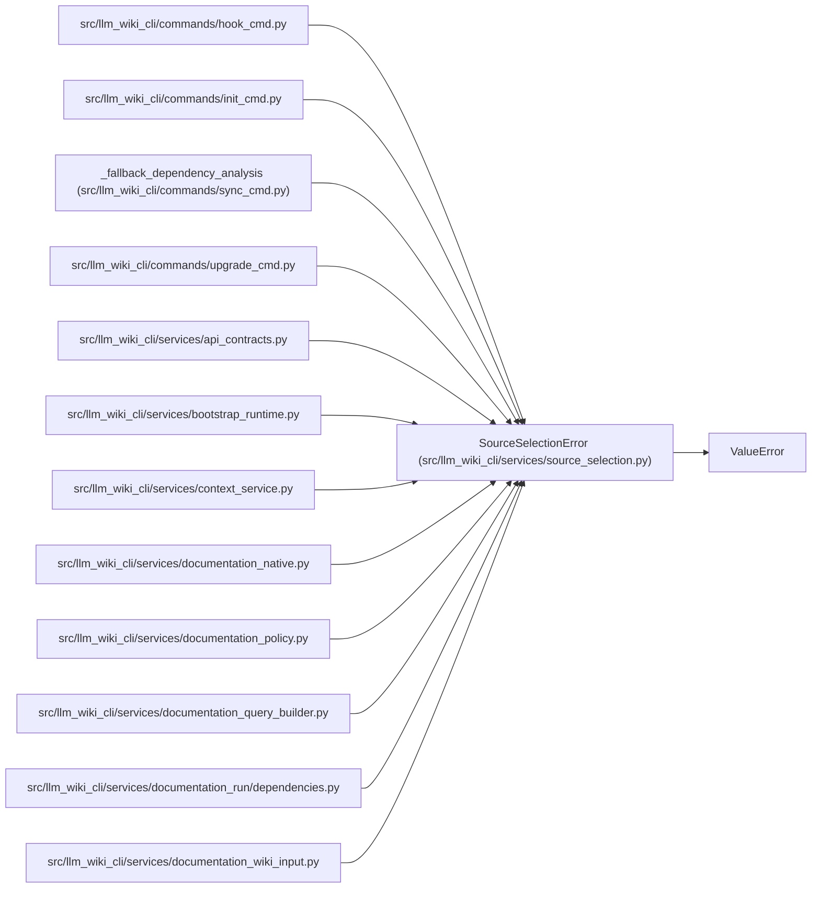

# SourceSelectionError

**Location:** `src/llm_wiki_cli/services/source_selection.py:39`
**Kind:** Class
**Bases:** `ValueError`
**Module:** [source_selection](../modules/source_selection.md)

## Description

Field-specific failure loading or validating source selection.

## Attributes

*No annotated attributes found.*

## Methods

| Method | Signature | Decorators | Description |
|--------|-----------|------------|-------------|
| `__init__` | `(field: str, message: str)` | — | — |

## Relationships

<!-- Auto-generated relationship summary. Do not edit by hand. -->

### Summary

| Module | Methods | Attributes |
|---|---:|---|
| [source_selection](../modules/source_selection.md) | 1 | — |

### Structure

| Kind | Entity | Module |
|---|---|---|
| Base | `ValueError` | — |

### References

| Reference | Kind | Source |
|---|---|---|
| `hook_cmd` | import | [hook_cmd](../modules/hook_cmd.md) |
| `init_cmd` | import | [init_cmd](../modules/init_cmd.md) |
| `_fallback_dependency_analysis` | call | [sync_cmd](../modules/sync_cmd.md) |
| `upgrade_cmd` | import | [upgrade_cmd](../modules/upgrade_cmd.md) |
| `api_contracts` | import | [api_contracts](../modules/api_contracts.md) |
| `bootstrap_runtime` | import | [bootstrap_runtime](../modules/bootstrap_runtime.md) |
| `context_service` | import | [context_service](../modules/context_service.md) |
| `documentation_native` | import | [documentation_native](../modules/documentation_native.md) |
| `documentation_policy` | import | [documentation_policy](../modules/documentation_policy.md) |
| `documentation_query_builder` | import | [documentation_query_builder](../modules/documentation_query_builder.md) |
| `dependencies` | import | [documentation_run_dependencies](../modules/documentation_run_dependencies.md) |
| `documentation_wiki_input` | import | [documentation_wiki_input](../modules/documentation_wiki_input.md) |
