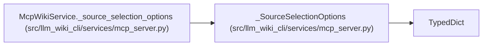

# _SourceSelectionOptions

**Location:** `src/llm_wiki_cli/services/mcp_server.py:106`
**Kind:** Class
**Bases:** `TypedDict`
**Module:** [mcp_server](../modules/mcp_server.md)

## Description

_Auto-generated from `_SourceSelectionOptions` in `src/llm_wiki_cli/services/mcp_server.py`._

## Attributes

| Name | Type | Default | Description |
|------|------|---------|-------------|
| `source_selection` | `str` | *required* | — |

## Methods

*No public methods. Inherits from base classes.*

## Relationships

<!-- Auto-generated relationship summary. Do not edit by hand. -->

### Summary

| Module | Methods | Attributes |
|---|---:|---|
| [mcp_server](../modules/mcp_server.md) | 0 | `source_selection` |

### Structure

| Kind | Entity | Module |
|---|---|---|
| Base | `TypedDict` | — |

### References

| Reference | Kind | Source |
|---|---|---|
| `McpWikiService._source_selection_options` | type_reference | [mcp_server](../modules/mcp_server.md) |
