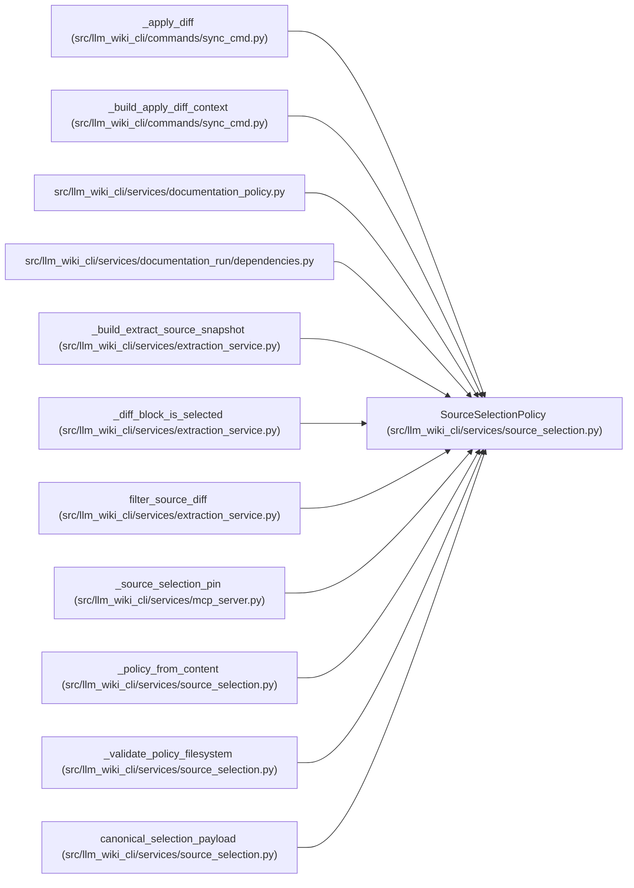

# SourceSelectionPolicy

**Location:** `src/llm_wiki_cli/services/source_selection.py:181`
**Kind:** Class
**Bases:** —
**Module:** [source_selection](../modules/source_selection.md)

**Decorators:** `@dataclass(frozen=True)`

## Description

Validated, immutable source-selection policy bound to one repository.

## Attributes

| Name | Type | Default | Description |
|------|------|---------|-------------|
| `schema_version` | `str` | *required* | — |
| `include` | `tuple[str, ...]` | *required* | — |
| `exclude` | `tuple[str, ...]` | *required* | — |
| `source_root` | `Path` | *required* | — |
| `path` | `str` | *required* | — |
| `origin` | `str` | *required* | — |
| `raw_content_hash` | `str` | *required* | — |

## Methods

| Method | Signature | Decorators | Description |
|--------|-----------|------------|-------------|
| `__post_init__` | `() -> None` | — | — |
| `fingerprint` | `() -> str` | `@property` | Return the canonical semantic policy fingerprint. |
| `identity` | `() -> dict[str, str]` | `@property` | Return the canonical persisted selection identity. |

## Relationships

<!-- Auto-generated relationship summary. Do not edit by hand. -->

### Summary

| Module | Methods | Attributes |
|---|---:|---|
| [source_selection](../modules/source_selection.md) | 3 | `exclude`, `include`, `origin`, `path`, `raw_content_hash`, `schema_version`, `source_root` |

### References

| Reference | Kind | Source |
|---|---|---|
| `_apply_diff` | type_reference | [sync_cmd](../modules/sync_cmd.md) |
| `_build_apply_diff_context` | type_reference | [sync_cmd](../modules/sync_cmd.md) |
| `documentation_policy` | import | [documentation_policy](../modules/documentation_policy.md) |
| `dependencies` | import | [documentation_run_dependencies](../modules/documentation_run_dependencies.md) |
| `_build_extract_source_snapshot` | type_reference | [extraction_service](../modules/extraction_service.md) |
| `_diff_block_is_selected` | type_reference | [extraction_service](../modules/extraction_service.md) |
| `filter_source_diff` | type_reference | [extraction_service](../modules/extraction_service.md) |
| `_source_selection_pin` | type_reference | [mcp_server](../modules/mcp_server.md) |
| `_policy_from_content` | call | [source_selection](../modules/source_selection.md) |
| `_policy_from_content` | type_reference | [source_selection](../modules/source_selection.md) |
| `_validate_policy_filesystem` | type_reference | [source_selection](../modules/source_selection.md) |
| `canonical_selection_payload` | type_reference | [source_selection](../modules/source_selection.md) |
