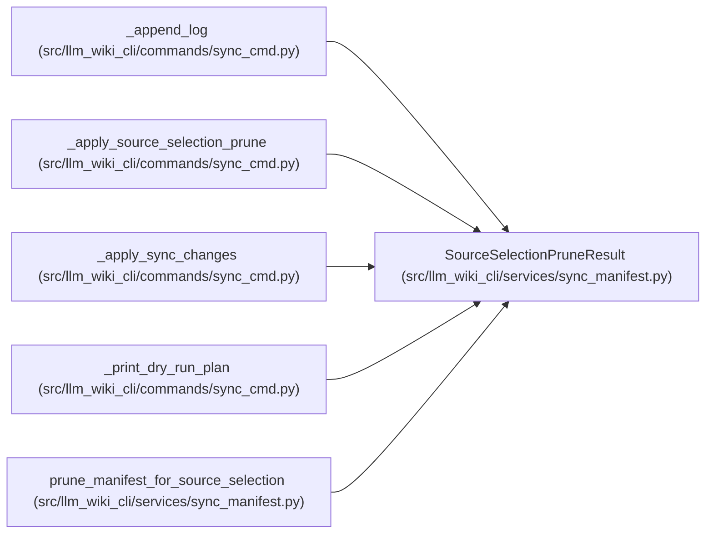

# SourceSelectionPruneResult

**Location:** `src/llm_wiki_cli/services/sync_manifest.py:71`
**Kind:** Class
**Bases:** —
**Module:** [sync_manifest](../modules/sync_manifest.md)

**Decorators:** `@dataclass(frozen=True)`

## Description

Manifest state removed because it falls outside a selected source set.

## Attributes

| Name | Type | Default | Description |
|------|------|---------|-------------|
| `manifest` | `SyncManifest` | *required* | — |
| `deselected_source_paths` | `tuple[str, ...]` | *required* | — |
| `deselected_page_paths` | `tuple[str, ...]` | *required* | — |
| `deselected_surface_page_paths` | `tuple[str, ...]` | `()` | — |

## Methods

*No public methods. Inherits from base classes.*

## Relationships

<!-- Auto-generated relationship summary. Do not edit by hand. -->

### Summary

| Module | Methods | Attributes |
|---|---:|---|
| [sync_manifest](../modules/sync_manifest.md) | 0 | `deselected_page_paths`, `deselected_source_paths`, `deselected_surface_page_paths`, `manifest` |

### References

| Reference | Kind | Source |
|---|---|---|
| `_append_log` | type_reference | [sync_cmd](../modules/sync_cmd.md) |
| `_apply_source_selection_prune` | type_reference | [sync_cmd](../modules/sync_cmd.md) |
| `_apply_sync_changes` | type_reference | [sync_cmd](../modules/sync_cmd.md) |
| `_print_dry_run_plan` | type_reference | [sync_cmd](../modules/sync_cmd.md) |
| `prune_manifest_for_source_selection` | call | [sync_manifest](../modules/sync_manifest.md) |
| `prune_manifest_for_source_selection` | call | [sync_manifest](../modules/sync_manifest.md) |
| `prune_manifest_for_source_selection` | call | [sync_manifest](../modules/sync_manifest.md) |
| `prune_manifest_for_source_selection` | type_reference | [sync_manifest](../modules/sync_manifest.md) |
