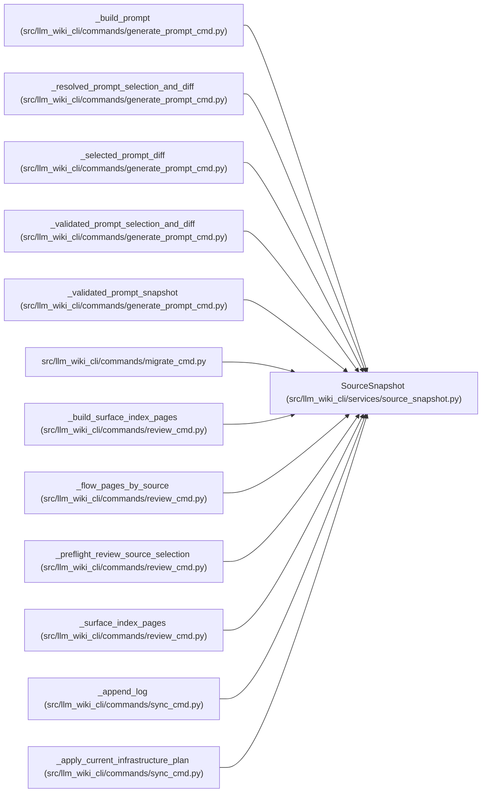

# SourceSnapshot

**Location:** `src/llm_wiki_cli/services/source_snapshot.py:126`
**Kind:** Class
**Bases:** —
**Module:** [source_snapshot](../modules/source_snapshot.md)

**Decorators:** `@dataclass(frozen=True)`

## Description

Filtered source-tree discovery results shared by lint/extract paths.

## Attributes

| Name | Type | Default | Description |
|------|------|---------|-------------|
| `root` | `Path` | *required* | — |
| `files_by_language` | `dict[str, tuple[SourceFile, ...]]` | *required* | — |
| `dockerfile_candidates` | `tuple[SourceFile, ...]` | *required* | — |
| `compose_candidates` | `tuple[SourceFile, ...]` | *required* | — |
| `yaml_candidates` | `tuple[SourceFile, ...]` | *required* | — |
| `package_markers` | `tuple[SourceFile, ...]` | *required* | — |
| `unsupported_files_by_language` | `dict[str, tuple[SourceFile, ...]]` | *required* | — |
| `all_source_paths` | `tuple[str, ...]` | *required* | — |
| `gitignore_fingerprint` | `str` | *required* | — |
| `captured_content_hashes` | `dict[str, str]` | *required* | — |
| `captured_input_kinds` | `dict[str, tuple[str, ...]]` | *required* | — |
| `source_selection_policy` | `SourceSelectionPolicy \| None` | `None` | — |
| `selected_regular_paths` | `frozenset[str]` | `frozenset()` | — |
| `gitignore_rules` | `tuple[_GitignoreRule, ...]` | `()` | — |
| `include_tests` | `frozenset[str]` | `frozenset()` | — |
| `only_files` | `frozenset[str] \| None` | `None` | — |
| `captured_file_integrity` | `dict[str, SourceFileIntegrity]` | `field(default_factory=dict)` | — |
| `captured_gitignore_paths` | `frozenset[str]` | `frozenset()` | — |

## Methods

| Method | Signature | Decorators | Description |
|--------|-----------|------------|-------------|
| `source_selection_path` | `() -> str \| None` | `@property` | Return the repository-relative policy path, when configured. |
| `source_selection_origin` | `() -> str \| None` | `@property` | Return whether selection was discovered by default or explicitly. |
| `source_selection_fingerprint` | `() -> str \| None` | `@property` | Return the semantic policy fingerprint, when configured. |
| `source_selection_identity` | `() -> dict[str, str] \| None` | `@property` | Return the canonical persisted policy identity, when configured. |
| `source_selection_inputs` | `() -> dict[str, object] \| None` | `@property` | Return exact configured profile/gitignore content commitments. |
| `path_is_effectively_selected` | `(path: str) -> bool` | — | Evaluate configured selection rules for an existing or missing path. |
| `path_may_contain_effective_selection` | `(path: str) -> bool` | — | Return whether a directory remains reachable by the live rules. |
| `language_paths` | `(language: str) -> list[str]` | — | Return deterministic relative paths for a language. |
| `unsupported_language_paths` | `(language: str) -> list[str]` | — | Return deterministic unsupported relative paths for a language. |
| `hashes_for` | `(paths: Iterable[str] \| None = None) -> dict[str, str]` | — | Return a validated copy of captured exact hashes without file I/O. |
| `to_consumed_inputs` | `(paths: Iterable[str] \| None = None) -> tuple[ConsumedInput, ...]` | — | Return canonical consumed inputs from already captured hashes. |
| `with_captured_inventory_paths` | `(paths: Iterable[str]) -> SourceSnapshot` | — | Commit extractor-returned paths absent from built-in discovery. |

## Relationships

<!-- Auto-generated relationship summary. Do not edit by hand. -->

### Summary

| Module | Methods | Attributes |
|---|---:|---|
| [source_snapshot](../modules/source_snapshot.md) | 12 | `all_source_paths`, `captured_content_hashes`, `captured_file_integrity`, `captured_gitignore_paths`, `captured_input_kinds`, `compose_candidates`, `dockerfile_candidates`, `files_by_language`, `gitignore_fingerprint`, `gitignore_rules`, `include_tests`, `only_files` |

### References

| Reference | Kind | Source | Call sites |
|---|---|---|---:|
| `_build_prompt` | type_reference | [generate_prompt_cmd](../modules/generate_prompt_cmd.md) | — |
| `_resolved_prompt_selection_and_diff` | type_reference | [generate_prompt_cmd](../modules/generate_prompt_cmd.md) | — |
| `_selected_prompt_diff` | type_reference | [generate_prompt_cmd](../modules/generate_prompt_cmd.md) | — |
| `_validated_prompt_selection_and_diff` | type_reference | [generate_prompt_cmd](../modules/generate_prompt_cmd.md) | — |
| `_validated_prompt_snapshot` | type_reference | [generate_prompt_cmd](../modules/generate_prompt_cmd.md) | — |
| `migrate_cmd` | import | [migrate_cmd](../modules/migrate_cmd.md) | — |
| `_build_surface_index_pages` | type_reference | [review_cmd](../modules/review_cmd.md) | — |
| `_flow_pages_by_source` | type_reference | [review_cmd](../modules/review_cmd.md) | — |
| `_preflight_review_source_selection` | type_reference | [review_cmd](../modules/review_cmd.md) | — |
| `_surface_index_pages` | type_reference | [review_cmd](../modules/review_cmd.md) | — |
| `_append_log` | type_reference | [sync_cmd](../modules/sync_cmd.md) | — |
| `_apply_current_infrastructure_plan` | type_reference | [sync_cmd](../modules/sync_cmd.md) | — |

> References: showing 12 of 146 logical references; 134 omitted by the 12-row generated summary limit.
