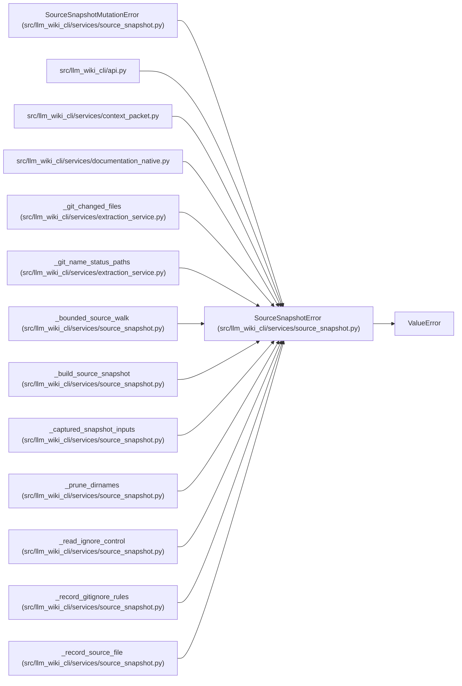

# SourceSnapshotError

**Location:** `src/llm_wiki_cli/services/source_snapshot.py:101`
**Kind:** Class
**Bases:** `ValueError`
**Module:** [source_snapshot](../modules/source_snapshot.md)

## Description

Field-specific failure selecting captured source snapshot state.

## Attributes

*No annotated attributes found.*

## Methods

| Method | Signature | Decorators | Description |
|--------|-----------|------------|-------------|
| `__init__` | `(field: str, message: str)` | — | — |

## Relationships

<!-- Auto-generated relationship summary. Do not edit by hand. -->

### Summary

| Module | Methods | Attributes |
|---|---:|---|
| [source_snapshot](../modules/source_snapshot.md) | 1 | — |

### Structure

| Kind | Entity | Module |
|---|---|---|
| Base | `ValueError` | — |
| Subclass | `SourceSnapshotMutationError` | [source_snapshot](../modules/source_snapshot.md) |

### References

| Reference | Kind | Source | Call sites |
|---|---|---|---:|
| `api` | import | [api](../modules/api.md) | — |
| `context_packet` | import | [context_packet](../modules/context_packet.md) | — |
| `documentation_native` | import | [documentation_native](../modules/documentation_native.md) | — |
| `_git_changed_files` | call | [extraction_service](../modules/extraction_service.md) | 1 |
| `_git_name_status_paths` | call | [extraction_service](../modules/extraction_service.md) | 3 |
| `_bounded_source_walk` | call | [source_snapshot](../modules/source_snapshot.md) | 2 |
| `_build_source_snapshot` | call | [source_snapshot](../modules/source_snapshot.md) | 1 |
| `_captured_snapshot_inputs` | call | [source_snapshot](../modules/source_snapshot.md) | 2 |
| `_prune_dirnames` | call | [source_snapshot](../modules/source_snapshot.md) | 2 |
| `_read_ignore_control` | call | [source_snapshot](../modules/source_snapshot.md) | 2 |
| `_record_gitignore_rules` | call | [source_snapshot](../modules/source_snapshot.md) | 7 |
| `_record_source_file` | call | [source_snapshot](../modules/source_snapshot.md) | 2 |

> References: showing 12 of 20 logical references; 8 omitted by the 12-row generated summary limit.
