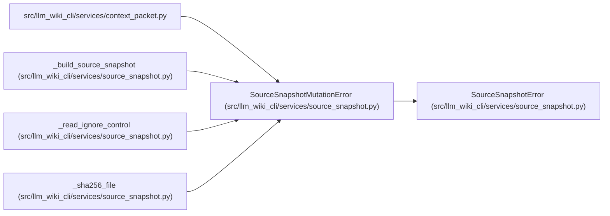

# SourceSnapshotMutationError

**Location:** `src/llm_wiki_cli/services/source_snapshot.py:110`
**Kind:** Class
**Bases:** `SourceSnapshotError`
**Module:** [source_snapshot](../modules/source_snapshot.md)

## Description

Reports a change between source hashing and capture. The owning context read retries within its declared policy or returns an explicit mutation failure; restored bytes cannot silently bind an observation to a different read.

## Attributes

*No annotated attributes found.*

## Methods

*No public methods. Inherits from base classes.*

## Relationships

<!-- Auto-generated relationship summary. Do not edit by hand. -->

### Summary

| Module | Methods | Attributes |
|---|---:|---|
| [source_snapshot](../modules/source_snapshot.md) | 0 | — |

### Structure

| Kind | Entity | Module |
|---|---|---|
| Base | `SourceSnapshotError` | [source_snapshot](../modules/source_snapshot.md) |

### References

| Reference | Kind | Source | Call sites |
|---|---|---|---:|
| `context_packet` | import | [context_packet](../modules/context_packet.md) | — |
| `_build_source_snapshot` | call | [source_snapshot](../modules/source_snapshot.md) | 2 |
| `_read_ignore_control` | call | [source_snapshot](../modules/source_snapshot.md) | 1 |
| `_sha256_file` | call | [source_snapshot](../modules/source_snapshot.md) | 1 |