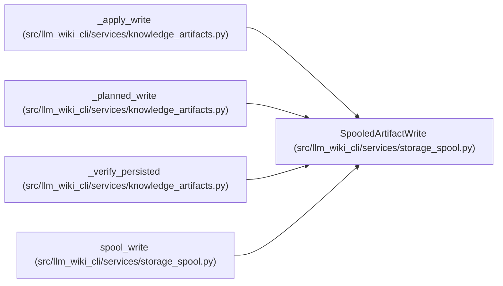

# SpooledArtifactWrite

**Location:** `src/llm_wiki_cli/services/storage_spool.py:81`
**Kind:** Class
**Bases:** —
**Module:** [storage_spool](../modules/storage_spool.md)

**Decorators:** `@dataclass(frozen=True)`

## Description

Exposes the content and previous-content byte interface of a planned artifact through a caller-owned spool. Commit validation still compares current files and verifies the planned content hash. The spool must outlive planning, publication and any later consumption of the result.

## Attributes

| Name | Type | Default | Description |
|------|------|---------|-------------|
| `path` | `Any` | *required* | — |
| `relative_path` | `str` | *required* | — |
| `state` | `Any` | *required* | — |
| `content_hash` | `str` | *required* | — |
| `needs_write` | `bool` | *required* | — |
| `_spool` | `ByteSpool` | *required* | — |
| `_new_key` | `str` | *required* | — |
| `_old_key` | `str \| None` | *required* | — |

## Methods

| Method | Signature | Decorators | Description |
|--------|-----------|------------|-------------|
| `content` | `() -> bytes` | `@property` | — |
| `previous_content` | `() -> bytes \| None` | `@property` | — |

## Relationships

<!-- Auto-generated relationship summary. Do not edit by hand. -->

### Summary

| Module | Methods | Attributes |
|---|---:|---|
| [storage_spool](../modules/storage_spool.md) | 2 | `_new_key`, `_old_key`, `_spool`, `content_hash`, `needs_write`, `path`, `relative_path`, `state` |

### References

| Reference | Kind | Source | Call sites |
|---|---|---|---:|
| `_apply_write` | type_reference | [knowledge_artifacts](../modules/knowledge_artifacts.md) | — |
| `_planned_write` | type_reference | [knowledge_artifacts](../modules/knowledge_artifacts.md) | — |
| `_verify_persisted` | type_reference | [knowledge_artifacts](../modules/knowledge_artifacts.md) | — |
| `spool_write` | call | [storage_spool](../modules/storage_spool.md) | 1 |
| `spool_write` | type_reference | [storage_spool](../modules/storage_spool.md) | — |
