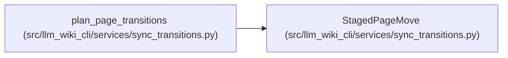

# StagedPageMove

**Location:** `src/llm_wiki_cli/services/sync_transitions.py:47`
**Kind:** Class
**Bases:** —
**Module:** [sync_transitions](../modules/sync_transitions.md)

**Decorators:** `@dataclass(frozen=True)`

## Description

_Auto-generated from `StagedPageMove` in `src/llm_wiki_cli/services/sync_transitions.py`._

## Attributes

| Name | Type | Default | Description |
|------|------|---------|-------------|
| `source_path` | `str` | *required* | — |
| `staging_slot` | `str` | *required* | — |
| `final_path` | `str` | *required* | — |

## Methods

*No public methods. Inherits from base classes.*

## Relationships

<!-- Auto-generated relationship summary. Do not edit by hand. -->

### Summary

| Module | Methods | Attributes |
|---|---:|---|
| [sync_transitions](../modules/sync_transitions.md) | 0 | `final_path`, `source_path`, `staging_slot` |

### References

| Reference | Kind | Source | Call sites |
|---|---|---|---:|
| `plan_page_transitions` | call | [sync_transitions](../modules/sync_transitions.md) | 1 |
