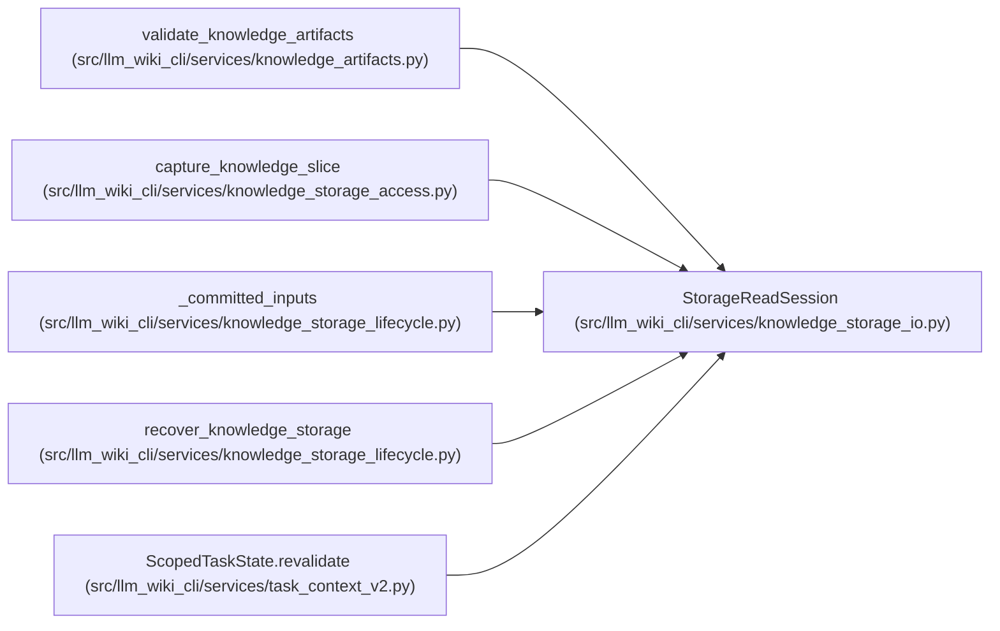

# StorageReadSession

**Location:** `src/llm_wiki_cli/services/knowledge_storage_io.py:109`
**Kind:** Class
**Bases:** —
**Module:** [knowledge_storage_io](../modules/knowledge_storage_io.md)

## Description

Bounds request-owned filesystem reads and records each exact observation. Repeated access and final checks detect changed inputs and count actual bytes; portable relative paths stay inside the trusted storage root.

## Attributes

*No annotated attributes found.*

## Methods

| Method | Signature | Decorators | Description |
|--------|-----------|------------|-------------|
| `__init__` | `(wiki_dir: str \| Path, *, max_bytes: int = MAX_EXPANDED_BYTES)` | — | — |
| `read` | `(relative: str, maximum: int) -> bytes` | — | — |
| `recheck` | `() -> None` | — | — |
| `receipt` | `() -> dict[str, Any]` | — | — |

## Relationships

<!-- Auto-generated relationship summary. Do not edit by hand. -->

### Summary

| Module | Methods | Attributes |
|---|---:|---|
| [knowledge_storage_io](../modules/knowledge_storage_io.md) | 4 | — |

### References

| Reference | Kind | Source | Call sites |
|---|---|---|---:|
| `validate_knowledge_artifacts` | call | [knowledge_artifacts](../modules/knowledge_artifacts.md) | 1 |
| `capture_knowledge_slice` | call | [knowledge_storage_access](../modules/knowledge_storage_access.md) | 1 |
| `_committed_inputs` | call | [knowledge_storage_lifecycle](../modules/knowledge_storage_lifecycle.md) | 1 |
| `recover_knowledge_storage` | call | [knowledge_storage_lifecycle](../modules/knowledge_storage_lifecycle.md) | 1 |
| `ScopedTaskState.revalidate` | call | [task_context_v2](../modules/task_context_v2.md) | 1 |