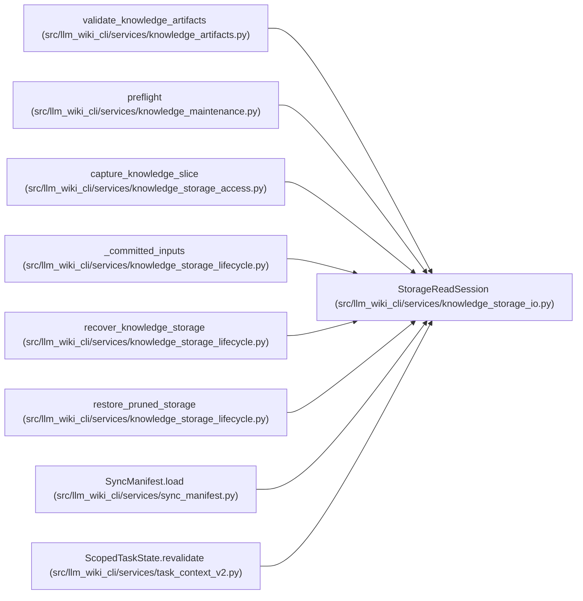

# StorageReadSession

**Location:** `src/llm_wiki_cli/services/knowledge_storage_io.py:313`
**Kind:** Class
**Bases:** —
**Module:** [knowledge_storage_io](../modules/knowledge_storage_io.md)

## Description

Retains request-owned observations of complete files and pack ranges. It counts actual bytes and read operations, enforces a cumulative budget and rejects inconsistent file identities across members of a pack. Final rechecks reread the consumed bytes through the same guarded filesystem owner; cache reuse never substitutes for this validation.

## Attributes

*No annotated attributes found.*

## Methods

| Method | Signature | Decorators | Description |
|--------|-----------|------------|-------------|
| `__init__` | `(wiki_dir: str \| Path, *, max_bytes: int = MAX_EXPANDED_BYTES, max_handles: int = 128, cancelled = None, coalesce_rechecks: bool = False)` | — | — |
| `phase` | `()` | `@contextmanager` | Keep observations provisional until successful phase validation and release. |
| `_read_guarded` | `(*args, **kwargs)` | — | — |
| `read` | `(relative: str, maximum: int) -> bytes` | — | — |
| `recheck` | `() -> None` | — | — |
| `read_range` | `(relative: str, offset: int, length: int, file_bytes: int) -> bytes` | — | Read and retain an authenticated member range, without reading its whole pack. |
| `_remember_range` | `(key, observed)` | — | — |
| `read_ranges` | `(ranges)` | — | Coalesce exact neighbours only: zero speculative or uncharged bytes. |
| `recheck_work` | `()` | — | — |
| `receipt` | `() -> dict[str, Any]` | — | — |

## Relationships

<!-- Auto-generated relationship summary. Do not edit by hand. -->

### Summary

| Module | Methods | Attributes |
|---|---:|---|
| [knowledge_storage_io](../modules/knowledge_storage_io.md) | 10 | — |

### References

| Reference | Kind | Source | Call sites |
|---|---|---|---:|
| `validate_knowledge_artifacts` | call | [knowledge_artifacts](../modules/knowledge_artifacts.md) | 2 |
| `preflight` | call | [knowledge_maintenance](../modules/knowledge_maintenance.md) | 1 |
| `capture_knowledge_slice` | call | [knowledge_storage_access](../modules/knowledge_storage_access.md) | 1 |
| `_committed_inputs` | call | [knowledge_storage_lifecycle](../modules/knowledge_storage_lifecycle.md) | 1 |
| `recover_knowledge_storage` | call | [knowledge_storage_lifecycle](../modules/knowledge_storage_lifecycle.md) | 1 |
| `restore_pruned_storage` | call | [knowledge_storage_lifecycle](../modules/knowledge_storage_lifecycle.md) | 1 |
| `SyncManifest.load` | call | [sync_manifest](../modules/sync_manifest.md) | 1 |
| `ScopedTaskState.revalidate` | call | [task_context_v2](../modules/task_context_v2.md) | 1 |
