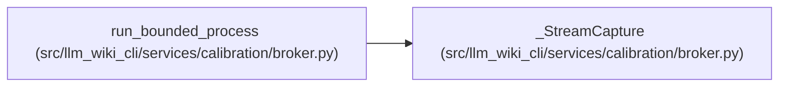

# _StreamCapture

**Location:** `src/llm_wiki_cli/services/calibration/broker.py:2535`
**Kind:** Class
**Bases:** —
**Module:** [broker](../modules/broker.md)

## Description

_Auto-generated from `_StreamCapture` in `src/llm_wiki_cli/services/calibration/broker.py`._

## Attributes

*No annotated attributes found.*

## Methods

| Method | Signature | Decorators | Description |
|--------|-----------|------------|-------------|
| `__init__` | `(limit: int) -> None` | — | — |
| `drain` | `(stream) -> None` | — | — |
| `finish` | `() -> _CapturedStream` | — | — |

## Relationships

<!-- Auto-generated relationship summary. Do not edit by hand. -->

### Summary

| Module | Methods | Attributes |
|---|---:|---|
| [broker](../modules/broker.md) | 3 | — |

### References

| Reference | Kind | Source |
|---|---|---|
| `run_bounded_process` | call | [broker](../modules/broker.md) |
| `run_bounded_process` | call | [broker](../modules/broker.md) |
