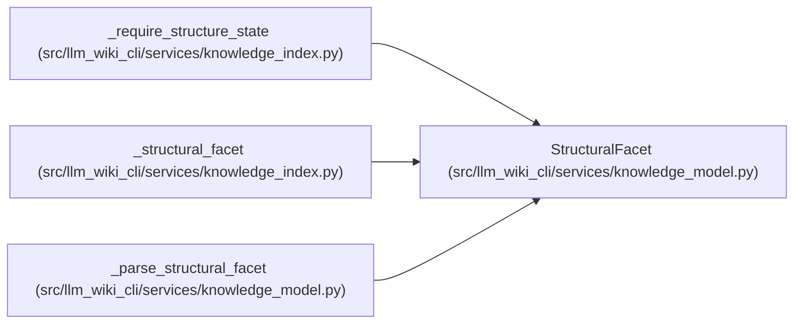

# StructuralFacet

**Location:** `src/llm_wiki_cli/services/knowledge_model.py:347`
**Kind:** Class
**Bases:** —
**Module:** [knowledge_model](../modules/knowledge_model.md)

**Decorators:** `@dataclass(frozen=True)`

## Description

_Auto-generated from `StructuralFacet` in `src/llm_wiki_cli/services/knowledge_model.py`._

## Attributes

| Name | Type | Default | Description |
|------|------|---------|-------------|
| `origin` | `Origin` | `Origin.UNKNOWN` | — |
| `evidence` | `EvidenceState` | `EvidenceState.UNKNOWN` | — |
| `basis` | `Optional[EvidenceBasis]` | `None` | — |
| `extensions` | `Extensions` | `field(default_factory=dict)` | — |

## Methods

*No public methods. Inherits from base classes.*

## Relationships

<!-- Auto-generated relationship summary. Do not edit by hand. -->

### Summary

| Module | Methods | Attributes |
|---|---:|---|
| [knowledge_model](../modules/knowledge_model.md) | 0 | `basis`, `evidence`, `extensions`, `origin` |

### References

| Reference | Kind | Source | Call sites |
|---|---|---|---:|
| `_require_structure_state` | type_reference | [knowledge_index](../modules/knowledge_index.md) | — |
| `_structural_facet` | call | [knowledge_index](../modules/knowledge_index.md) | 4 |
| `_structural_facet` | type_reference | [knowledge_index](../modules/knowledge_index.md) | — |
| `_parse_structural_facet` | call | [knowledge_model](../modules/knowledge_model.md) | 1 |
| `_parse_structural_facet` | type_reference | [knowledge_model](../modules/knowledge_model.md) | — |
