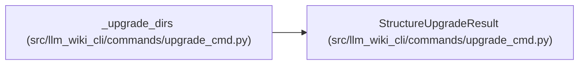

# StructureUpgradeResult

**Location:** `src/llm_wiki_cli/commands/upgrade_cmd.py:95`
**Kind:** Class
**Bases:** —
**Module:** [upgrade_cmd](../modules/upgrade_cmd.md)

**Decorators:** `@dataclass(frozen=True)`

## Description

Paths created while refreshing the framework-owned wiki structure.

## Attributes

| Name | Type | Default | Description |
|------|------|---------|-------------|
| `directories` | `tuple[str, ...]` | *required* | — |
| `gitkeeps` | `tuple[str, ...]` | *required* | — |
| `files` | `tuple[str, ...]` | *required* | — |

## Methods

| Method | Signature | Decorators | Description |
|--------|-----------|------------|-------------|
| `created_count` | `() -> int` | `@property` | — |

## Relationships

<!-- Auto-generated relationship summary. Do not edit by hand. -->

### Summary

| Module | Methods | Attributes |
|---|---:|---|
| [upgrade_cmd](../modules/upgrade_cmd.md) | 1 | `directories`, `files`, `gitkeeps` |

### References

| Reference | Kind | Source |
|---|---|---|
| `_upgrade_dirs` | call | [upgrade_cmd](../modules/upgrade_cmd.md) |
| `_upgrade_dirs` | type_reference | [upgrade_cmd](../modules/upgrade_cmd.md) |
