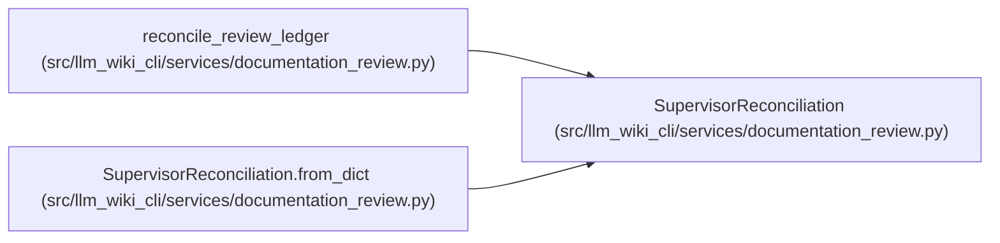

# SupervisorReconciliation

**Location:** `src/llm_wiki_cli/services/documentation_review.py:310`
**Kind:** Class
**Bases:** —
**Module:** [documentation_review](../modules/documentation_review.md)

**Decorators:** `@dataclass(frozen=True)`

## Description

Independent supervisor disposition for a clean review ledger.

## Attributes

| Name | Type | Default | Description |
|------|------|---------|-------------|
| `packet` | `DocumentationReviewPacket` | *required* | — |
| `approved` | `bool` | *required* | — |
| `rationale` | `str` | *required* | — |
| `reviewed_finding_ids` | `tuple[str, ...]` | *required* | — |
| `evidence` | `tuple[str, ...]` | *required* | — |
| `reconciled_at` | `str` | *required* | — |

## Methods

| Method | Signature | Decorators | Description |
|--------|-----------|------------|-------------|
| `to_dict` | `() -> dict[str, Any]` | — | — |
| `from_dict` | `(payload: Mapping[str, Any]) -> 'SupervisorReconciliation'` | `@classmethod` | — |

## Relationships

<!-- Auto-generated relationship summary. Do not edit by hand. -->

### Summary

| Module | Methods | Attributes |
|---|---:|---|
| [documentation_review](../modules/documentation_review.md) | 2 | `approved`, `evidence`, `packet`, `rationale`, `reconciled_at`, `reviewed_finding_ids` |

### References

| Reference | Kind | Source |
|---|---|---|
| `reconcile_review_ledger` | call | [documentation_review](../modules/documentation_review.md) |
| `SupervisorReconciliation.from_dict` | type_reference | [documentation_review](../modules/documentation_review.md) |
