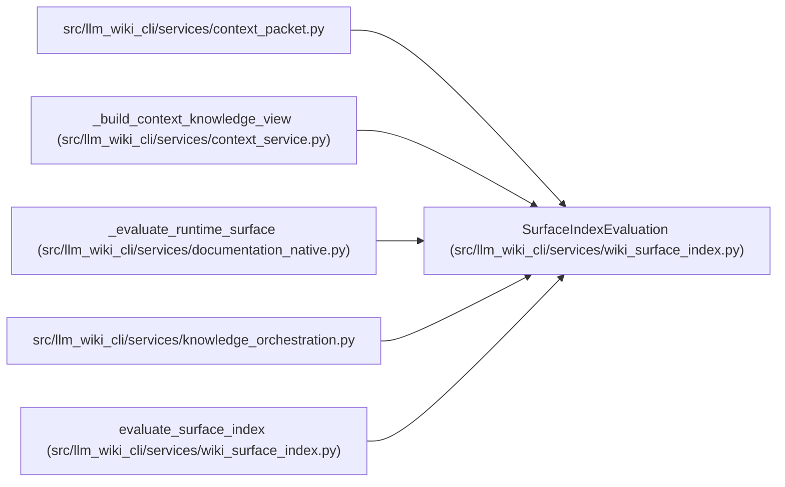

# SurfaceIndexEvaluation

**Location:** `src/llm_wiki_cli/services/wiki_surface_index.py:39`
**Kind:** Class
**Bases:** —
**Module:** [wiki_surface_index](../modules/wiki_surface_index.md)

**Decorators:** `@dataclass(frozen=True)`

## Description

One collected canonical-page view reused by projection builders.

## Attributes

| Name | Type | Default | Description |
|------|------|---------|-------------|
| `pages` | `tuple[WikiSurfacePage, ...]` | *required* | — |
| `content_by_path` | `Mapping[str, str]` | *required* | — |
| `payload` | `Mapping[str, Any]` | *required* | — |
| `serialized_bytes` | `bytes` | *required* | — |
| `existing_asset_paths` | `frozenset[str]` | *required* | — |

## Methods

*No public methods. Inherits from base classes.*

## Relationships

<!-- Auto-generated relationship summary. Do not edit by hand. -->

### Summary

| Module | Methods | Attributes |
|---|---:|---|
| [wiki_surface_index](../modules/wiki_surface_index.md) | 0 | `content_by_path`, `existing_asset_paths`, `pages`, `payload`, `serialized_bytes` |

### References

| Reference | Kind | Source |
|---|---|---|
| `context_packet` | import | [context_packet](../modules/context_packet.md) |
| `_build_context_knowledge_view` | type_reference | [context_service](../modules/context_service.md) |
| `_evaluate_runtime_surface` | type_reference | [documentation_native](../modules/documentation_native.md) |
| `knowledge_orchestration` | import | [knowledge_orchestration](../modules/knowledge_orchestration.md) |
| `evaluate_surface_index` | call | [wiki_surface_index](../modules/wiki_surface_index.md) |
| `evaluate_surface_index` | type_reference | [wiki_surface_index](../modules/wiki_surface_index.md) |
