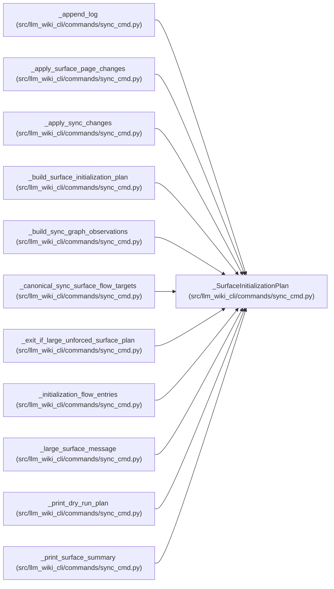

# _SurfaceInitializationPlan

**Location:** `src/llm_wiki_cli/commands/sync_cmd.py:1646`
**Kind:** Class
**Bases:** —
**Module:** [sync_cmd](../modules/sync_cmd.md)

**Decorators:** `@dataclass(frozen=True)`

## Description

_Auto-generated from `_SurfaceInitializationPlan` in `src/llm_wiki_cli/commands/sync_cmd.py`._

## Attributes

| Name | Type | Default | Description |
|------|------|---------|-------------|
| `surfaces` | `dict[str, dict]` | *required* | — |
| `policy_changed` | `bool` | *required* | — |
| `flow_entries` | `tuple[dict, ...]` | *required* | — |
| `new_flow_entries` | `tuple[dict, ...]` | *required* | — |
| `excluded_flow_tests` | `int` | *required* | — |
| `dependency_inventory` | `dict` | *required* | — |
| `dependency_analysis` | `dict \| None` | *required* | — |
| `dependency_target_pages` | `tuple[str, ...]` | *required* | — |
| `new_dependency_pages` | `tuple[str, ...]` | *required* | — |
| `requested_surfaces` | `frozenset[str]` | *required* | — |
| `excluded_dependency_tests` | `int` | `0` | — |
| `api_contracts` | `dict \| None` | `None` | — |
| `api_contract_target` | `bool` | `False` | — |
| `new_api_contract_page` | `bool` | `False` | — |
| `generation_inputs` | `dict[str, object]` | `field(default_factory=dict)` | — |
| `generation_inputs_changed` | `bool` | `False` | — |
| `managed_flow_page_paths` | `frozenset[str]` | `frozenset()` | — |
| `managed_workflow_page_paths` | `frozenset[str]` | `frozenset()` | — |
| `new_workflow_page_paths` | `tuple[str, ...]` | `()` | — |
| `managed_surface_index` | `bool` | `False` | — |
| `prior_surface_source_overrides` | `tuple[tuple[str, str], ...]` | `()` | — |
| `prior_flow_entries` | `tuple[dict, ...]` | `()` | — |

## Methods

| Method | Signature | Decorators | Description |
|--------|-----------|------------|-------------|
| `created_pages` | `() -> int` | `@property` | — |
| `has_work` | `() -> bool` | `@property` | — |

## Relationships

<!-- Auto-generated relationship summary. Do not edit by hand. -->

### Summary

| Module | Methods | Attributes |
|---|---:|---|
| [sync_cmd](../modules/sync_cmd.md) | 2 | `api_contract_target`, `api_contracts`, `dependency_analysis`, `dependency_inventory`, `dependency_target_pages`, `excluded_dependency_tests`, `excluded_flow_tests`, `flow_entries`, `generation_inputs`, `generation_inputs_changed`, `managed_flow_page_paths`, `managed_surface_index` |

### References

| Reference | Kind | Source | Call sites |
|---|---|---|---:|
| `_append_log` | type_reference | [sync_cmd](../modules/sync_cmd.md) | — |
| `_apply_surface_page_changes` | type_reference | [sync_cmd](../modules/sync_cmd.md) | — |
| `_apply_sync_changes` | type_reference | [sync_cmd](../modules/sync_cmd.md) | — |
| `_build_surface_initialization_plan` | call | [sync_cmd](../modules/sync_cmd.md) | 1 |
| `_build_surface_initialization_plan` | type_reference | [sync_cmd](../modules/sync_cmd.md) | — |
| `_build_sync_graph_observations` | type_reference | [sync_cmd](../modules/sync_cmd.md) | — |
| `_canonical_sync_surface_flow_targets` | type_reference | [sync_cmd](../modules/sync_cmd.md) | — |
| `_exit_if_large_unforced_surface_plan` | type_reference | [sync_cmd](../modules/sync_cmd.md) | — |
| `_initialization_flow_entries` | type_reference | [sync_cmd](../modules/sync_cmd.md) | — |
| `_large_surface_message` | type_reference | [sync_cmd](../modules/sync_cmd.md) | — |
| `_print_dry_run_plan` | type_reference | [sync_cmd](../modules/sync_cmd.md) | — |
| `_print_surface_summary` | type_reference | [sync_cmd](../modules/sync_cmd.md) | — |

> References: showing 12 of 17 logical references; 5 omitted by the 12-row generated summary limit.
