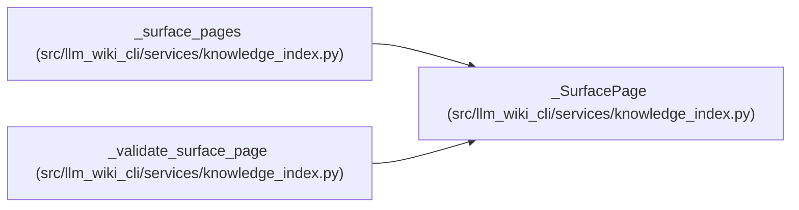

# _SurfacePage

**Location:** `src/llm_wiki_cli/services/knowledge_index.py:162`
**Kind:** Class
**Bases:** —
**Module:** [knowledge_index](../modules/knowledge_index.md)

**Decorators:** `@dataclass(frozen=True)`

## Description

_Auto-generated from `_SurfacePage` in `src/llm_wiki_cli/services/knowledge_index.py`._

## Attributes

| Name | Type | Default | Description |
|------|------|---------|-------------|
| `index` | `int` | *required* | — |
| `canonical_path` | `str` | *required* | — |
| `page_kind` | `PageKind` | *required* | — |
| `page_id` | `str` | *required* | — |
| `role` | `SurfaceRole` | *required* | — |
| `locator` | `str` | *required* | — |
| `title` | `str` | *required* | — |
| `source_path` | `str \| None` | *required* | — |

## Methods

*No public methods. Inherits from base classes.*

## Relationships

<!-- Auto-generated relationship summary. Do not edit by hand. -->

### Summary

| Module | Methods | Attributes |
|---|---:|---|
| [knowledge_index](../modules/knowledge_index.md) | 0 | `canonical_path`, `index`, `locator`, `page_id`, `page_kind`, `role`, `source_path`, `title` |

### References

| Reference | Kind | Source |
|---|---|---|
| `_surface_pages` | call | [knowledge_index](../modules/knowledge_index.md) |
| `_surface_pages` | type_reference | [knowledge_index](../modules/knowledge_index.md) |
| `_validate_surface_page` | type_reference | [knowledge_index](../modules/knowledge_index.md) |
