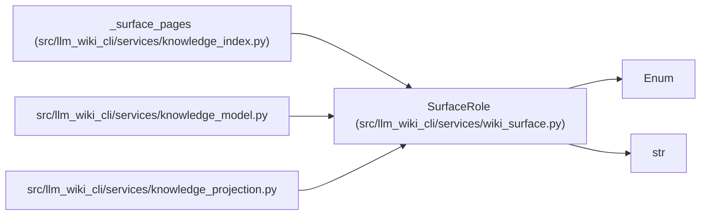

# SurfaceRole

**Location:** `src/llm_wiki_cli/services/wiki_surface.py:55`
**Kind:** Enum
**Bases:** `str`, `Enum`
**Module:** [wiki_surface](../modules/wiki_surface.md)

## Description

_Auto-generated from `SurfaceRole` in `src/llm_wiki_cli/services/wiki_surface.py`._

## Attributes

| Name | Declared value | Description |
|------|-------|-------------|
| `GENERATED` | `'generated'` | — |
| `SEMANTIC` | `'semantic'` | — |
| `MIXED` | `'mixed'` | — |

## Methods

*No public methods. Inherits from base classes.*

## Relationships

<!-- Auto-generated relationship summary. Do not edit by hand. -->

### Summary

| Module | Methods | Attributes |
|---|---:|---|
| [wiki_surface](../modules/wiki_surface.md) | 0 | `GENERATED`, `MIXED`, `SEMANTIC` |

### Structure

| Kind | Entity | Module |
|---|---|---|
| Base | `Enum` | — |
| Base | `str` | — |

### References

| Reference | Kind | Source | Call sites |
|---|---|---|---:|
| `_surface_pages` | call | [knowledge_index](../modules/knowledge_index.md) | 1 |
| `knowledge_model` | import | [knowledge_model](../modules/knowledge_model.md) | — |
| `knowledge_projection` | import | [knowledge_projection](../modules/knowledge_projection.md) | — |
