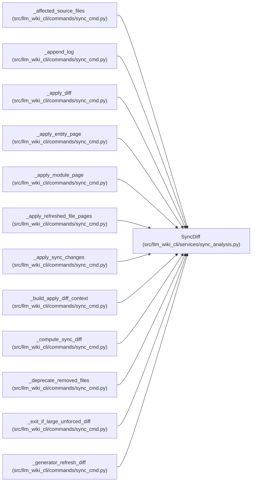

# SyncDiff

**Location:** `src/llm_wiki_cli/services/sync_analysis.py:20`
**Kind:** Class
**Bases:** —
**Module:** [sync_analysis](../modules/sync_analysis.md)

**Decorators:** `@dataclass`

## Description

Categorised difference between a persisted manifest and live inventory.

## Attributes

| Name | Type | Default | Description |
|------|------|---------|-------------|
| `new_files` | `list[str]` | `field(default_factory=list)` | — |
| `changed_files` | `list[str]` | `field(default_factory=list)` | — |
| `metadata_only_files` | `list[str]` | `field(default_factory=list)` | — |
| `unchanged_files` | `list[str]` | `field(default_factory=list)` | — |
| `removed_files` | `list[str]` | `field(default_factory=list)` | — |
| `moved_entities` | `dict[str, tuple[str, str]]` | `field(default_factory=dict)` | — |
| `renamed_entity_pages` | `dict[tuple[str, str], tuple[str, str]]` | `field(default_factory=dict)` | — |
| `renamed_module_pages` | `dict[str, tuple[str, str]]` | `field(default_factory=dict)` | — |

## Methods

| Method | Signature | Decorators | Description |
|--------|-----------|------------|-------------|
| `has_changes` | `() -> bool` | `@property` | — |

## Relationships

<!-- Auto-generated relationship summary. Do not edit by hand. -->

### Summary

| Module | Methods | Attributes |
|---|---:|---|
| [sync_analysis](../modules/sync_analysis.md) | 1 | `changed_files`, `metadata_only_files`, `moved_entities`, `new_files`, `removed_files`, `renamed_entity_pages`, `renamed_module_pages`, `unchanged_files` |

### References

| Reference | Kind | Source |
|---|---|---|
| `_affected_source_files` | type_reference | [sync_cmd](../modules/sync_cmd.md) |
| `_append_log` | type_reference | [sync_cmd](../modules/sync_cmd.md) |
| `_apply_diff` | type_reference | [sync_cmd](../modules/sync_cmd.md) |
| `_apply_entity_page` | type_reference | [sync_cmd](../modules/sync_cmd.md) |
| `_apply_module_page` | type_reference | [sync_cmd](../modules/sync_cmd.md) |
| `_apply_refreshed_file_pages` | type_reference | [sync_cmd](../modules/sync_cmd.md) |
| `_apply_sync_changes` | type_reference | [sync_cmd](../modules/sync_cmd.md) |
| `_build_apply_diff_context` | type_reference | [sync_cmd](../modules/sync_cmd.md) |
| `_compute_sync_diff` | type_reference | [sync_cmd](../modules/sync_cmd.md) |
| `_deprecate_removed_files` | type_reference | [sync_cmd](../modules/sync_cmd.md) |
| `_exit_if_large_unforced_diff` | type_reference | [sync_cmd](../modules/sync_cmd.md) |
| `_generator_refresh_diff` | type_reference | [sync_cmd](../modules/sync_cmd.md) |
