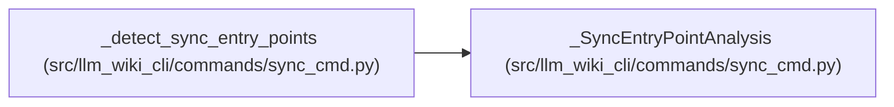

# _SyncEntryPointAnalysis

**Location:** `src/llm_wiki_cli/commands/sync_cmd.py:1618`
**Kind:** Class
**Bases:** —
**Module:** [sync_cmd](../modules/sync_cmd.md)

**Decorators:** `@dataclass(frozen=True)`

## Description

_Auto-generated from `_SyncEntryPointAnalysis` in `src/llm_wiki_cli/commands/sync_cmd.py`._

## Attributes

| Name | Type | Default | Description |
|------|------|---------|-------------|
| `entries` | `list[dict]` | *required* | — |
| `observations` | `dict` | *required* | — |

## Methods

*No public methods. Inherits from base classes.*

## Relationships

<!-- Auto-generated relationship summary. Do not edit by hand. -->

### Summary

| Module | Methods | Attributes |
|---|---:|---|
| [sync_cmd](../modules/sync_cmd.md) | 0 | `entries`, `observations` |

### References

| Reference | Kind | Source | Call sites |
|---|---|---|---:|
| `_detect_sync_entry_points` | call | [sync_cmd](../modules/sync_cmd.md) | 1 |
| `_detect_sync_entry_points` | type_reference | [sync_cmd](../modules/sync_cmd.md) | — |
