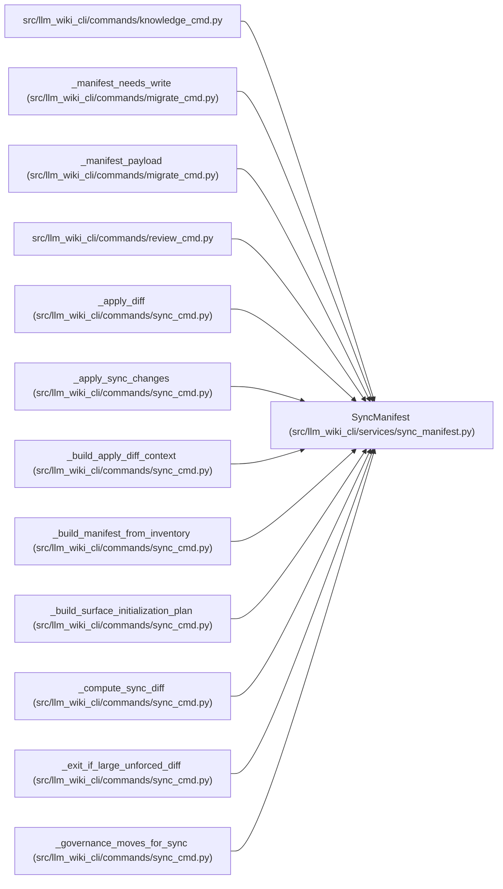

# SyncManifest

**Location:** `src/llm_wiki_cli/services/sync_manifest.py:933`
**Kind:** Class
**Bases:** —
**Module:** [sync_manifest](../modules/sync_manifest.md)

**Decorators:** `@dataclass`

## Description

Persistent v5 operational state used to generate the wiki.

## Attributes

| Name | Type | Default | Description |
|------|------|---------|-------------|
| `sources` | `dict[str, dict]` | `field(default_factory=dict)` | — |
| `surfaces` | `dict[str, dict]` | `field(default_factory=dict)` | — |
| `generation_inputs` | `dict[str, object]` | `field(default_factory=dict)` | — |
| `page_source_mappings` | `dict[str, ManifestPageSource]` | `field(default_factory=dict)` | — |
| `evidence_baselines` | `dict[str, ManifestEvidenceBaseline]` | `field(default_factory=dict)` | — |
| `tombstones` | `dict[str, ManifestTombstone]` | `field(default_factory=dict)` | — |
| `artifact_hashes` | `ManifestArtifactHashes \| None` | `None` | — |

## Methods

| Method | Signature | Decorators | Description |
|--------|-----------|------------|-------------|
| `from_payload` | `(value: object) -> SyncManifest` | `@classmethod` | Validate and migrate one decoded manifest payload. |
| `load` | `(wiki_dir: Path) -> SyncManifest` | `@classmethod` | Load a manifest; raise ``FileNotFoundError`` when it is absent. |
| `_validate_operational_state` | `() -> None` | — | — |
| `_validate_basis_mapping` | `(basis: ConceptObservationBasis \| None, mapping: ManifestPageSource, field_name: str) -> None` | `@staticmethod` | — |
| `to_payload` | `() -> dict[str, object]` | — | Return the validated deterministic manifest v5 payload. |
| `to_json` | `() -> str` | — | Return deterministic UTF-8-ready JSON with one trailing newline. |
| `save` | `(wiki_dir: Path) -> None` | — | Atomically write the manifest through the shared JSON boundary. |
| `with_artifact_hashes` | `(*, surface_index_hash: str, knowledge_index_hash: str, evaluated_envelope_hash: str, governance_hash: str \| None = None) -> SyncManifest` | — | Return a copy carrying one complete artifact-set commitment. |
| `without_artifact_hashes` | `() -> SyncManifest` | — | Return a copy with no artifact-set commitment. |
| `with_generation_state` | `(*, surfaces: Mapping[str, Mapping], generation_inputs: Mapping[str, object]) -> SyncManifest` | — | Replace generation policy while invalidating any prior commitment. |
| `build_from_inventory` | `(inventory: dict, src_dir: str, entity_page_cache: dict[tuple[str, str], str], module_page_map: dict[str, str], *, entity_occurrence_page_cache: dict[tuple[str, str, int], str] \| None = None, surfaces: Mapping[str, Mapping] \| None = None, generation_inputs: Mapping[str, object] \| None = None, previous_manifest: SyncManifest \| None = None, evidence_baselines: Mapping[str, ConceptObservationBasis \| ManifestEvidenceBaseline] \| None = None, source_content_hashes: Mapping[str, str] \| None = None, retained_page_paths: Iterable[str] \| None = None, unknown_evidence_reason: str = EVIDENCE_NOT_RECORDED) -> SyncManifest` | `@classmethod` | Build current state and reconcile retained prior page evidence. |

## Relationships

<!-- Auto-generated relationship summary. Do not edit by hand. -->

### Summary

| Module | Methods | Attributes |
|---|---:|---|
| [sync_manifest](../modules/sync_manifest.md) | 11 | `artifact_hashes`, `evidence_baselines`, `generation_inputs`, `page_source_mappings`, `sources`, `surfaces`, `tombstones` |

### References

| Reference | Kind | Source |
|---|---|---|
| `knowledge_cmd` | import | [knowledge_cmd](../modules/knowledge_cmd.md) |
| `_manifest_needs_write` | type_reference | [migrate_cmd](../modules/migrate_cmd.md) |
| `_manifest_payload` | type_reference | [migrate_cmd](../modules/migrate_cmd.md) |
| `review_cmd` | import | [review_cmd](../modules/review_cmd.md) |
| `_apply_diff` | type_reference | [sync_cmd](../modules/sync_cmd.md) |
| `_apply_sync_changes` | type_reference | [sync_cmd](../modules/sync_cmd.md) |
| `_build_apply_diff_context` | type_reference | [sync_cmd](../modules/sync_cmd.md) |
| `_build_manifest_from_inventory` | type_reference | [sync_cmd](../modules/sync_cmd.md) |
| `_build_surface_initialization_plan` | type_reference | [sync_cmd](../modules/sync_cmd.md) |
| `_compute_sync_diff` | type_reference | [sync_cmd](../modules/sync_cmd.md) |
| `_exit_if_large_unforced_diff` | type_reference | [sync_cmd](../modules/sync_cmd.md) |
| `_governance_moves_for_sync` | type_reference | [sync_cmd](../modules/sync_cmd.md) |
