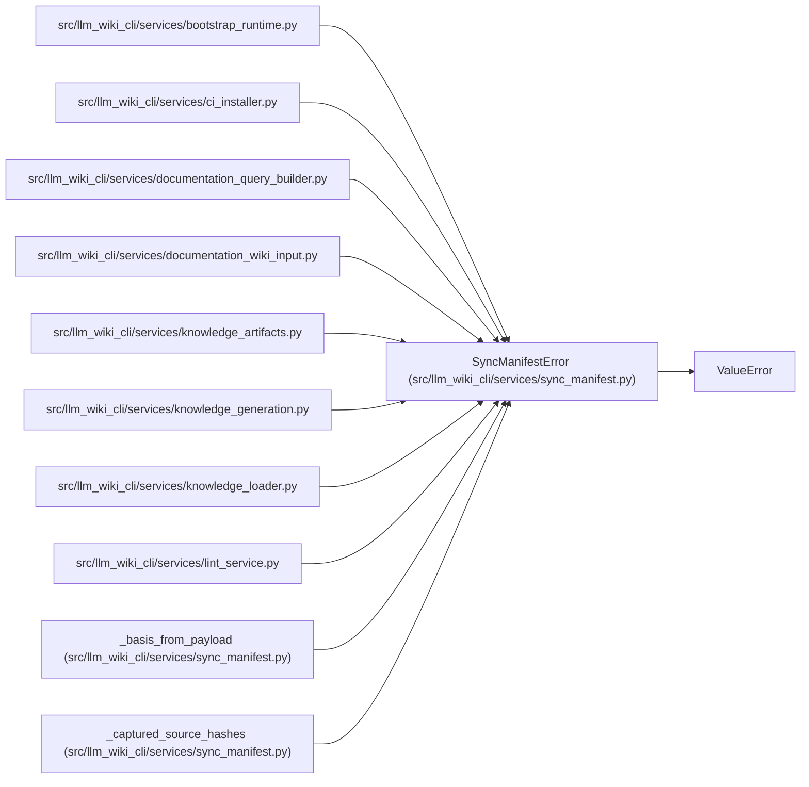

# SyncManifestError

**Location:** `src/llm_wiki_cli/services/sync_manifest.py:60`
**Kind:** Class
**Bases:** `ValueError`
**Module:** [sync_manifest](../modules/sync_manifest.md)

## Description

Field-specific validation failure for decoded manifest state.

## Attributes

*No annotated attributes found.*

## Methods

| Method | Signature | Decorators | Description |
|--------|-----------|------------|-------------|
| `__init__` | `(field: str, message: str, *, code: str \| None = None)` | — | — |

## Relationships

<!-- Auto-generated relationship summary. Do not edit by hand. -->

### Summary

| Module | Methods | Attributes |
|---|---:|---|
| [sync_manifest](../modules/sync_manifest.md) | 1 | — |

### Structure

| Kind | Entity | Module |
|---|---|---|
| Base | `ValueError` | — |

### References

| Reference | Kind | Source |
|---|---|---|
| `bootstrap_runtime` | import | [bootstrap_runtime](../modules/bootstrap_runtime.md) |
| `ci_installer` | import | [ci_installer](../modules/ci_installer.md) |
| `documentation_query_builder` | import | [documentation_query_builder](../modules/documentation_query_builder.md) |
| `documentation_wiki_input` | import | [documentation_wiki_input](../modules/documentation_wiki_input.md) |
| `knowledge_artifacts` | import | [knowledge_artifacts](../modules/knowledge_artifacts.md) |
| `knowledge_generation` | import | [knowledge_generation](../modules/knowledge_generation.md) |
| `knowledge_loader` | import | [knowledge_loader](../modules/knowledge_loader.md) |
| `lint_service` | import | [lint_service](../modules/lint_service.md) |
| `_basis_from_payload` | call | [sync_manifest](../modules/sync_manifest.md) |
| `_captured_source_hashes` | call | [sync_manifest](../modules/sync_manifest.md) |
| `_captured_source_hashes` | call | [sync_manifest](../modules/sync_manifest.md) |
| `_captured_source_hashes` | call | [sync_manifest](../modules/sync_manifest.md) |
