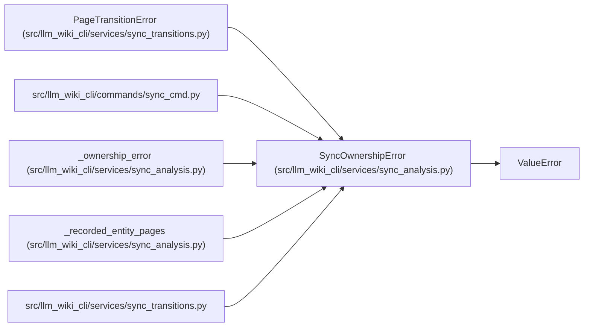

# SyncOwnershipError

**Location:** `src/llm_wiki_cli/services/sync_analysis.py:26`
**Kind:** Class
**Bases:** `ValueError`
**Module:** [sync_analysis](../modules/sync_analysis.md)

## Description

A page cannot be safely assigned to one recorded source entity.

## Attributes

*No annotated attributes found.*

## Methods

*No public methods. Inherits from base classes.*

## Relationships

<!-- Auto-generated relationship summary. Do not edit by hand. -->

### Summary

| Module | Methods | Attributes |
|---|---:|---|
| [sync_analysis](../modules/sync_analysis.md) | 0 | — |

### Structure

| Kind | Entity | Module |
|---|---|---|
| Base | `ValueError` | — |
| Subclass | `PageTransitionError` | [sync_transitions](../modules/sync_transitions.md) |

### References

| Reference | Kind | Source | Call sites |
|---|---|---|---:|
| `sync_cmd` | import | [sync_cmd](../modules/sync_cmd.md) | — |
| `_ownership_error` | call | [sync_analysis](../modules/sync_analysis.md) | 1 |
| `_ownership_error` | type_reference | [sync_analysis](../modules/sync_analysis.md) | — |
| `_recorded_entity_pages` | call | [sync_analysis](../modules/sync_analysis.md) | 2 |
| `sync_transitions` | import | [sync_transitions](../modules/sync_transitions.md) | — |
