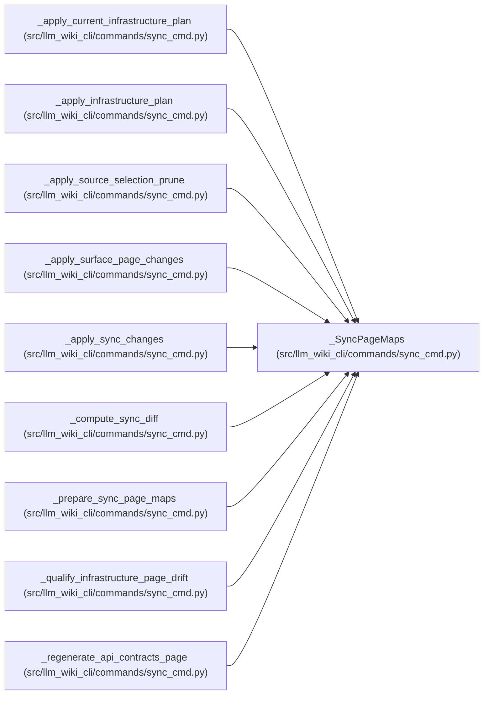

# _SyncPageMaps

**Location:** `src/llm_wiki_cli/commands/sync_cmd.py:1605`
**Kind:** Class
**Bases:** —
**Module:** [sync_cmd](../modules/sync_cmd.md)

**Decorators:** `@dataclass(frozen=True)`

## Description

_Auto-generated from `_SyncPageMaps` in `src/llm_wiki_cli/commands/sync_cmd.py`._

## Attributes

| Name | Type | Default | Description |
|------|------|---------|-------------|
| `module_page_map` | `dict[str, str]` | *required* | — |
| `entity_page_cache` | `dict[tuple[str, str], str]` | *required* | — |
| `entity_occurrence_page_cache` | `dict[tuple[str, str, int], str]` | *required* | — |

## Methods

*No public methods. Inherits from base classes.*

## Relationships

<!-- Auto-generated relationship summary. Do not edit by hand. -->

### Summary

| Module | Methods | Attributes |
|---|---:|---|
| [sync_cmd](../modules/sync_cmd.md) | 0 | `entity_occurrence_page_cache`, `entity_page_cache`, `module_page_map` |

### References

| Reference | Kind | Source | Call sites |
|---|---|---|---:|
| `_apply_current_infrastructure_plan` | type_reference | [sync_cmd](../modules/sync_cmd.md) | — |
| `_apply_infrastructure_plan` | type_reference | [sync_cmd](../modules/sync_cmd.md) | — |
| `_apply_source_selection_prune` | type_reference | [sync_cmd](../modules/sync_cmd.md) | — |
| `_apply_surface_page_changes` | type_reference | [sync_cmd](../modules/sync_cmd.md) | — |
| `_apply_sync_changes` | type_reference | [sync_cmd](../modules/sync_cmd.md) | — |
| `_compute_sync_diff` | type_reference | [sync_cmd](../modules/sync_cmd.md) | — |
| `_prepare_sync_page_maps` | call | [sync_cmd](../modules/sync_cmd.md) | 1 |
| `_prepare_sync_page_maps` | type_reference | [sync_cmd](../modules/sync_cmd.md) | — |
| `_qualify_infrastructure_page_drift` | type_reference | [sync_cmd](../modules/sync_cmd.md) | — |
| `_regenerate_api_contracts_page` | type_reference | [sync_cmd](../modules/sync_cmd.md) | — |
