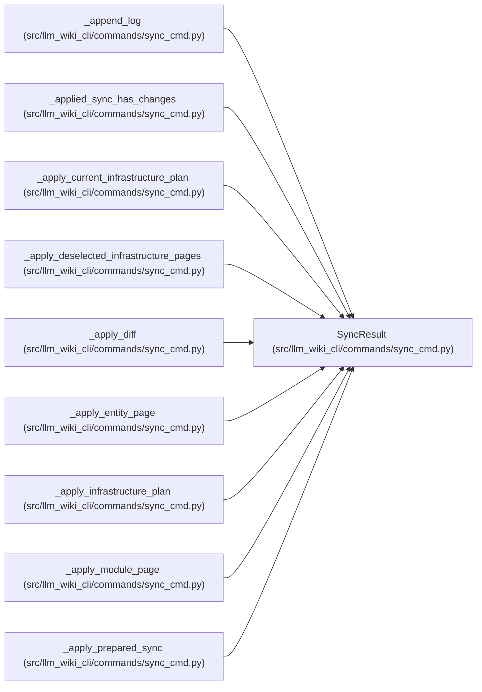

# SyncResult

**Location:** `src/llm_wiki_cli/commands/sync_cmd.py:589`
**Kind:** Class
**Bases:** —
**Module:** [sync_cmd](../modules/sync_cmd.md)

**Decorators:** `@dataclass`

## Description

_Auto-generated from `SyncResult` in `src/llm_wiki_cli/commands/sync_cmd.py`._

## Attributes

| Name | Type | Default | Description |
|------|------|---------|-------------|
| `created` | `int` | `0` | — |
| `updated` | `int` | `0` | — |
| `metadata_only` | `int` | `0` | — |
| `skipped` | `int` | `0` | — |
| `deprecated` | `int` | `0` | — |
| `preserved_semantic` | `int` | `0` | — |

## Methods

*No public methods. Inherits from base classes.*

## Relationships

<!-- Auto-generated relationship summary. Do not edit by hand. -->

### Summary

| Module | Methods | Attributes |
|---|---:|---|
| [sync_cmd](../modules/sync_cmd.md) | 0 | `created`, `deprecated`, `metadata_only`, `preserved_semantic`, `skipped`, `updated` |

### References

| Reference | Kind | Source |
|---|---|---|
| `_append_log` | type_reference | [sync_cmd](../modules/sync_cmd.md) |
| `_applied_sync_has_changes` | type_reference | [sync_cmd](../modules/sync_cmd.md) |
| `_apply_current_infrastructure_plan` | type_reference | [sync_cmd](../modules/sync_cmd.md) |
| `_apply_deselected_infrastructure_pages` | type_reference | [sync_cmd](../modules/sync_cmd.md) |
| `_apply_diff` | call | [sync_cmd](../modules/sync_cmd.md) |
| `_apply_diff` | type_reference | [sync_cmd](../modules/sync_cmd.md) |
| `_apply_entity_page` | type_reference | [sync_cmd](../modules/sync_cmd.md) |
| `_apply_infrastructure_plan` | type_reference | [sync_cmd](../modules/sync_cmd.md) |
| `_apply_module_page` | type_reference | [sync_cmd](../modules/sync_cmd.md) |
| `_apply_prepared_sync` | call | [sync_cmd](../modules/sync_cmd.md) |
| `_apply_prepared_sync` | call | [sync_cmd](../modules/sync_cmd.md) |
| `_apply_prepared_sync` | call | [sync_cmd](../modules/sync_cmd.md) |
