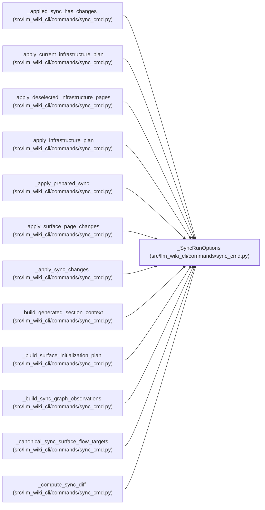

# _SyncRunOptions

**Location:** `src/llm_wiki_cli/commands/sync_cmd.py:1587`
**Kind:** Class
**Bases:** —
**Module:** [sync_cmd](../modules/sync_cmd.md)

**Decorators:** `@dataclass(frozen=True)`

## Description

_Auto-generated from `_SyncRunOptions` in `src/llm_wiki_cli/commands/sync_cmd.py`._

## Attributes

| Name | Type | Default | Description |
|------|------|---------|-------------|
| `src_dir` | `str` | *required* | — |
| `wiki_dir` | `Path` | *required* | — |
| `allow_external_src` | `bool` | *required* | — |
| `cache_options` | `InventoryCacheOptions` | *required* | — |
| `cache_stats_enabled` | `bool` | *required* | — |
| `parallel_jobs` | `int` | *required* | — |
| `job_request` | `ExtractionJobRequest` | *required* | — |
| `plan_reporter` | `Callable[[ExtractionJobPlan], None] \| None` | *required* | — |
| `helper_cache_dir` | `str \| None` | *required* | — |
| `include_tests` | `Iterable[str] \| None` | *required* | — |
| `force` | `bool` | *required* | — |
| `preserve_semantic` | `bool` | *required* | — |
| `initialize_surfaces` | `frozenset[str]` | *required* | — |
| `flow_categories` | `frozenset[str] \| None` | *required* | — |
| `exclude_tests` | `bool` | *required* | — |
| `dry_run` | `bool` | *required* | — |
| `include_plugins` | `bool` | *required* | — |
| `openapi_file` | `str \| None` | *required* | — |
| `clear_openapi_file` | `bool` | *required* | — |
| `source_selection` | `str \| Path \| None` | *required* | — |

## Methods

*No public methods. Inherits from base classes.*

## Relationships

<!-- Auto-generated relationship summary. Do not edit by hand. -->

### Summary

| Module | Methods | Attributes |
|---|---:|---|
| [sync_cmd](../modules/sync_cmd.md) | 0 | `allow_external_src`, `cache_options`, `cache_stats_enabled`, `clear_openapi_file`, `dry_run`, `exclude_tests`, `flow_categories`, `force`, `helper_cache_dir`, `include_plugins`, `include_tests`, `initialize_surfaces` |

### References

| Reference | Kind | Source | Call sites |
|---|---|---|---:|
| `_applied_sync_has_changes` | type_reference | [sync_cmd](../modules/sync_cmd.md) | — |
| `_apply_current_infrastructure_plan` | type_reference | [sync_cmd](../modules/sync_cmd.md) | — |
| `_apply_deselected_infrastructure_pages` | type_reference | [sync_cmd](../modules/sync_cmd.md) | — |
| `_apply_infrastructure_plan` | type_reference | [sync_cmd](../modules/sync_cmd.md) | — |
| `_apply_prepared_sync` | type_reference | [sync_cmd](../modules/sync_cmd.md) | — |
| `_apply_surface_page_changes` | type_reference | [sync_cmd](../modules/sync_cmd.md) | — |
| `_apply_sync_changes` | type_reference | [sync_cmd](../modules/sync_cmd.md) | — |
| `_build_generated_section_context` | type_reference | [sync_cmd](../modules/sync_cmd.md) | — |
| `_build_surface_initialization_plan` | type_reference | [sync_cmd](../modules/sync_cmd.md) | — |
| `_build_sync_graph_observations` | type_reference | [sync_cmd](../modules/sync_cmd.md) | — |
| `_canonical_sync_surface_flow_targets` | type_reference | [sync_cmd](../modules/sync_cmd.md) | — |
| `_compute_sync_diff` | type_reference | [sync_cmd](../modules/sync_cmd.md) | — |

> References: showing 12 of 38 logical references; 26 omitted by the 12-row generated summary limit.
