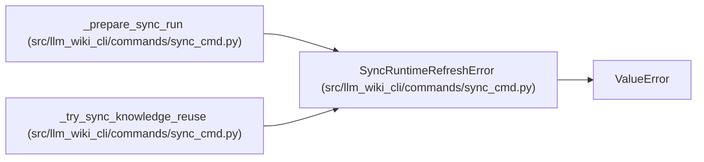

# SyncRuntimeRefreshError

**Location:** `src/llm_wiki_cli/commands/sync_cmd.py:270`
**Kind:** Class
**Bases:** `ValueError`
**Module:** [sync_cmd](../modules/sync_cmd.md)

## Description

A runtime-basis transition cannot be applied in the requested mode.

## Attributes

*No annotated attributes found.*

## Methods

*No public methods. Inherits from base classes.*

## Relationships

<!-- Auto-generated relationship summary. Do not edit by hand. -->

### Summary

| Module | Methods | Attributes |
|---|---:|---|
| [sync_cmd](../modules/sync_cmd.md) | 0 | — |

### Structure

| Kind | Entity | Module |
|---|---|---|
| Base | `ValueError` | — |

### References

| Reference | Kind | Source | Call sites |
|---|---|---|---:|
| `_prepare_sync_run` | call | [sync_cmd](../modules/sync_cmd.md) | 1 |
| `_try_sync_knowledge_reuse` | call | [sync_cmd](../modules/sync_cmd.md) | 7 |
