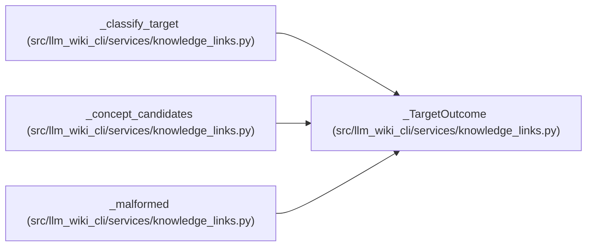

# _TargetOutcome

**Location:** `src/llm_wiki_cli/services/knowledge_links.py:118`
**Kind:** Class
**Bases:** —
**Module:** [knowledge_links](../modules/knowledge_links.md)

**Decorators:** `@dataclass(frozen=True)`

## Description

_Auto-generated from `_TargetOutcome` in `src/llm_wiki_cli/services/knowledge_links.py`._

## Attributes

| Name | Type | Default | Description |
|------|------|---------|-------------|
| `target_class` | `TargetClass` | *required* | — |
| `resolution` | `Resolution` | *required* | — |
| `canonical_path` | `str \| None` | `None` | — |
| `external_uri` | `str \| None` | `None` | — |

## Methods

*No public methods. Inherits from base classes.*

## Relationships

<!-- Auto-generated relationship summary. Do not edit by hand. -->

### Summary

| Module | Methods | Attributes |
|---|---:|---|
| [knowledge_links](../modules/knowledge_links.md) | 0 | `canonical_path`, `external_uri`, `resolution`, `target_class` |

### References

| Reference | Kind | Source | Call sites |
|---|---|---|---:|
| `_classify_target` | call | [knowledge_links](../modules/knowledge_links.md) | 6 |
| `_classify_target` | type_reference | [knowledge_links](../modules/knowledge_links.md) | — |
| `_concept_candidates` | call | [knowledge_links](../modules/knowledge_links.md) | 3 |
| `_concept_candidates` | type_reference | [knowledge_links](../modules/knowledge_links.md) | — |
| `_malformed` | call | [knowledge_links](../modules/knowledge_links.md) | 1 |
| `_malformed` | type_reference | [knowledge_links](../modules/knowledge_links.md) | — |
