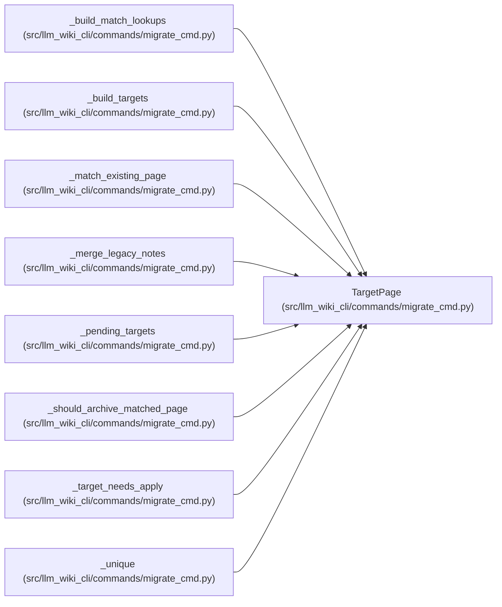

# TargetPage

**Location:** `src/llm_wiki_cli/commands/migrate_cmd.py:128`
**Kind:** Class
**Bases:** —
**Module:** [migrate_cmd](../modules/migrate_cmd.md)

**Decorators:** `@dataclass(frozen=True)`

## Description

A canonical page generated from the current source inventory.

## Attributes

| Name | Type | Default | Description |
|------|------|---------|-------------|
| `kind` | `str` | *required* | — |
| `stem` | `str` | *required* | — |
| `rel` | `str` | *required* | — |
| `content` | `str` | *required* | — |
| `source_path` | `str \| None` | `None` | — |
| `entity_name` | `str \| None` | `None` | — |
| `line` | `int \| None` | `None` | — |

## Methods

*No public methods. Inherits from base classes.*

## Relationships

<!-- Auto-generated relationship summary. Do not edit by hand. -->

### Summary

| Module | Methods | Attributes |
|---|---:|---|
| [migrate_cmd](../modules/migrate_cmd.md) | 0 | `content`, `entity_name`, `kind`, `line`, `rel`, `source_path`, `stem` |

### References

| Reference | Kind | Source |
|---|---|---|
| `_build_match_lookups` | type_reference | [migrate_cmd](../modules/migrate_cmd.md) |
| `_build_targets` | call | [migrate_cmd](../modules/migrate_cmd.md) |
| `_build_targets` | call | [migrate_cmd](../modules/migrate_cmd.md) |
| `_build_targets` | call | [migrate_cmd](../modules/migrate_cmd.md) |
| `_build_targets` | type_reference | [migrate_cmd](../modules/migrate_cmd.md) |
| `_match_existing_page` | type_reference | [migrate_cmd](../modules/migrate_cmd.md) |
| `_merge_legacy_notes` | type_reference | [migrate_cmd](../modules/migrate_cmd.md) |
| `_pending_targets` | type_reference | [migrate_cmd](../modules/migrate_cmd.md) |
| `_should_archive_matched_page` | type_reference | [migrate_cmd](../modules/migrate_cmd.md) |
| `_target_needs_apply` | type_reference | [migrate_cmd](../modules/migrate_cmd.md) |
| `_unique` | type_reference | [migrate_cmd](../modules/migrate_cmd.md) |
