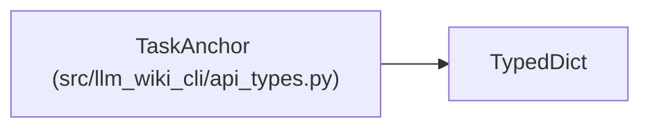

# TaskAnchor

**Location:** `src/llm_wiki_cli/api_types.py:17`
**Kind:** Class
**Bases:** `TypedDict`
**Module:** [api_types](../modules/api_types.md)

## Description

An explicitly typed source, symbol, wiki or concept coordinate. Coordinates constrain discovery and preserve lexical ownership; an empty or excluded selection does not authorize a broader source scan.

## Attributes

| Name | Type | Presence | Description |
|------|------|----------|-------------|
| `kind` | `Literal['source', 'symbol', 'concept', 'wiki']` | *required* | — |
| `value` | `str` | *required* | — |

## Methods

*No public methods. Inherits from base classes.*

## Relationships

<!-- Auto-generated relationship summary. Do not edit by hand. -->

### Summary

| Module | Methods | Attributes |
|---|---:|---|
| [api_types](../modules/api_types.md) | 0 | `kind`, `value` |

### Structure

| Kind | Entity | Module |
|---|---|---|
| Base | `TypedDict` | — |
