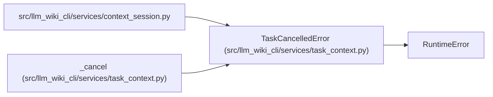

# TaskCancelledError

**Location:** `src/llm_wiki_cli/services/task_context.py:42`
**Kind:** Class
**Bases:** `RuntimeError`
**Module:** [task_context](../modules/task_context.md)

## Description

Signals host cancellation before publication of a task result. Cancellation discards pending context and retained session resources instead of presenting mixed or partial evidence as success.

## Attributes

*No annotated attributes found.*

## Methods

*No public methods. Inherits from base classes.*

## Relationships

<!-- Auto-generated relationship summary. Do not edit by hand. -->

### Summary

| Module | Methods | Attributes |
|---|---:|---|
| [task_context](../modules/task_context.md) | 0 | — |

### Structure

| Kind | Entity | Module |
|---|---|---|
| Base | `RuntimeError` | — |

### References

| Reference | Kind | Source | Call sites |
|---|---|---|---:|
| `context_session` | import | [context_session](../modules/context_session.md) | — |
| `_cancel` | call | [task_context](../modules/task_context.md) | 1 |