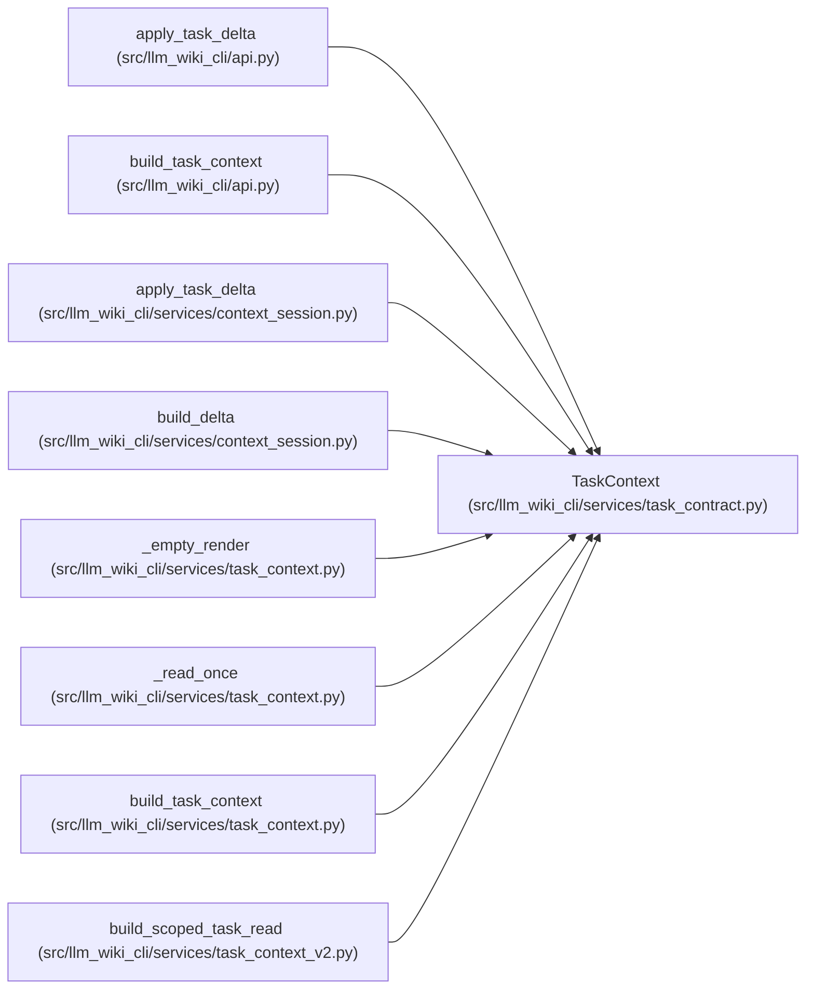

# TaskContext

**Location:** `src/llm_wiki_cli/services/task_contract.py:109`
**Kind:** Class
**Bases:** —
**Module:** [task_contract](../modules/task_contract.md)

**Decorators:** `@dataclass(frozen=True)`

## Description

Canonical task output with complete-representation accounting. Successful construction can still contain missing, ambiguous, unsupported or stale requirements. Payload access returns detached values; a cannot-fit result contains no partial context.

## Attributes

| Name | Type | Default | Description |
|------|------|---------|-------------|
| `ok` | `bool` | *required* | — |
| `rendered` | `str` | *required* | — |
| `accounting` | `Mapping[str, Any]` | *required* | — |
| `error` | `str \| None` | `None` | — |
| `schema_version` | `str` | `TASK_RESULT_SCHEMA` | — |

## Methods

| Method | Signature | Decorators | Description |
|--------|-----------|------------|-------------|
| `__post_init__` | `()` | — | — |
| `to_payload` | `() -> dict[str, Any]` | — | — |
| `result_id` | `() -> str \| None` | `@property` | — |

## Relationships

<!-- Auto-generated relationship summary. Do not edit by hand. -->

### Summary

| Module | Methods | Attributes |
|---|---:|---|
| [task_contract](../modules/task_contract.md) | 3 | `accounting`, `error`, `ok`, `rendered`, `schema_version` |

### References

| Reference | Kind | Source | Call sites |
|---|---|---|---:|
| `apply_task_delta` | type_reference | [api](../modules/api.md) | — |
| `build_task_context` | type_reference | [api](../modules/api.md) | — |
| `apply_task_delta` | call | [context_session](../modules/context_session.md) | 1 |
| `apply_task_delta` | type_reference | [context_session](../modules/context_session.md) | — |
| `build_delta` | type_reference | [context_session](../modules/context_session.md) | — |
| `_empty_render` | call | [task_context](../modules/task_context.md) | 2 |
| `_read_once` | call | [task_context](../modules/task_context.md) | 1 |
| `build_task_context` | type_reference | [task_context](../modules/task_context.md) | — |
| `build_scoped_task_read` | call | [task_context_v2](../modules/task_context_v2.md) | 2 |
