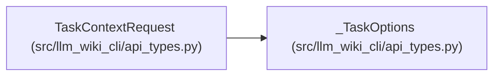

# TaskContextRequest

**Location:** `src/llm_wiki_cli/api_types.py:43`
**Kind:** Class
**Bases:** `_TaskOptions`
**Module:** [api_types](../modules/api_types.md)

## Description

The versioned task request, combining bounded intent, exact anchors, observable requirements, change selection and permitted setting overrides. Free-form task text is retrieval input and cannot grant execution or filesystem authority.

## Attributes

| Name | Type | Presence | Description |
|------|------|----------|-------------|
| `schema_version` | `Literal['llm-wiki-task-request/v1']` | *required* | — |

## Methods

*No public methods. Inherits from base classes.*

## Relationships

<!-- Auto-generated relationship summary. Do not edit by hand. -->

### Summary

| Module | Methods | Attributes |
|---|---:|---|
| [api_types](../modules/api_types.md) | 0 | `schema_version` |

### Structure

| Kind | Entity | Module |
|---|---|---|
| Base | `_TaskOptions` | [api_types](../modules/api_types.md) |
