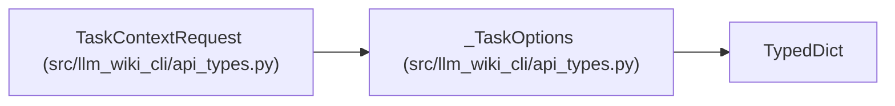

# _TaskOptions

**Location:** `src/llm_wiki_cli/api_types.py:40`
**Kind:** Class
**Bases:** `TypedDict`
**Module:** [api_types](../modules/api_types.md)

## Description

Optional task intent, host attribution, exact selectors, requirements, change selection and bounded overrides. None of these fields changes the host-owned workspace or execution permissions.

## Attributes

| Name | Type | Presence | Description |
|------|------|----------|-------------|
| `text` | `str` | *optional* | — |
| `kind` | `Literal['orientation', 'bug-diagnosis', 'contract-change', 'refactor']` | *optional* | — |
| `task_ref` | `str` | *optional* | — |
| `anchors` | `list[TaskAnchor]` | *optional* | — |
| `requirements` | `list[EvidenceRequirement]` | *optional* | — |
| `changes` | `dict[str, Any]` | *optional* | — |
| `options` | `dict[str, Any]` | *optional* | — |
| `storage_options` | `TaskStorageOptions` | *optional* | — |

## Methods

*No public methods. Inherits from base classes.*

## Relationships

<!-- Auto-generated relationship summary. Do not edit by hand. -->

### Summary

| Module | Methods | Attributes |
|---|---:|---|
| [api_types](../modules/api_types.md) | 0 | `anchors`, `changes`, `kind`, `options`, `requirements`, `storage_options`, `task_ref`, `text` |

### Structure

| Kind | Entity | Module |
|---|---|---|
| Base | `TypedDict` | — |
| Subclass | `TaskContextRequest` | [api_types](../modules/api_types.md) |
