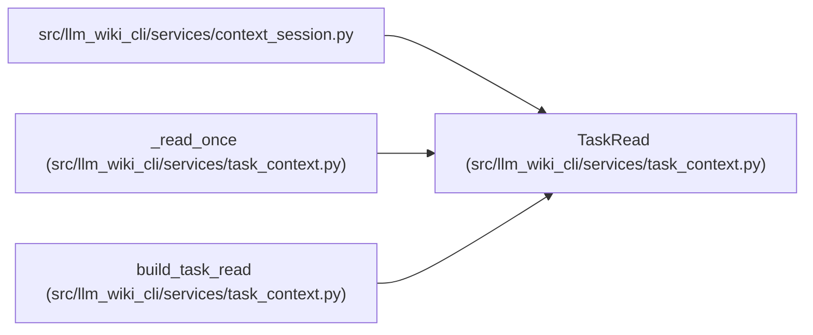

# TaskRead

**Location:** `src/llm_wiki_cli/services/task_context.py:47`
**Kind:** Class
**Bases:** —
**Module:** [task_context](../modules/task_context.md)

**Decorators:** `@dataclass`

## Description

Private request-owned capture state retained only for an explicitly bounded session. It binds normalized intent, effective profile, input commitments and immutable output without making cache lifetime part of packet validity.

## Attributes

| Name | Type | Default | Description |
|------|------|---------|-------------|
| `normalized` | `dict[str, Any]` | *required* | — |
| `profile` | `WorkflowProfile` | *required* | — |
| `captured` | `packets.CapturedContextRead \| None` | *required* | — |
| `wiki_root` | `Path` | *required* | — |
| `wiki_anchor` | `str` | *required* | — |
| `result` | `TaskContext` | *required* | — |
| `wiki_integrity` | `Mapping[str, tuple[int, ...]] \| None` | `None` | — |

## Methods

*No public methods. Inherits from base classes.*

## Relationships

<!-- Auto-generated relationship summary. Do not edit by hand. -->

### Summary

| Module | Methods | Attributes |
|---|---:|---|
| [task_context](../modules/task_context.md) | 0 | `captured`, `normalized`, `profile`, `result`, `wiki_anchor`, `wiki_integrity`, `wiki_root` |

### References

| Reference | Kind | Source | Call sites |
|---|---|---|---:|
| `context_session` | import | [context_session](../modules/context_session.md) | — |
| `_read_once` | call | [task_context](../modules/task_context.md) | 1 |
| `build_task_read` | type_reference | [task_context](../modules/task_context.md) | — |
