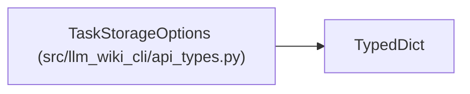

# TaskStorageOptions

**Location:** `src/llm_wiki_cli/api_types.py:33`
**Kind:** Class
**Bases:** `TypedDict`
**Module:** [api_types](../modules/api_types.md)

## Description

Optional selection and proof layout for task request v2.

## Attributes

| Name | Type | Presence | Description |
|------|------|----------|-------------|
| `selection` | `Literal['all-collections-v1', 'required-facets-v1']` | *optional* | — |
| `receipt` | `Literal['expanded-v1', 'compact-v1']` | *optional* | — |

## Methods

*No public methods. Inherits from base classes.*

## Relationships

<!-- Auto-generated relationship summary. Do not edit by hand. -->

### Summary

| Module | Methods | Attributes |
|---|---:|---|
| [api_types](../modules/api_types.md) | 0 | `receipt`, `selection` |

### Structure

| Kind | Entity | Module |
|---|---|---|
| Base | `TypedDict` | — |
