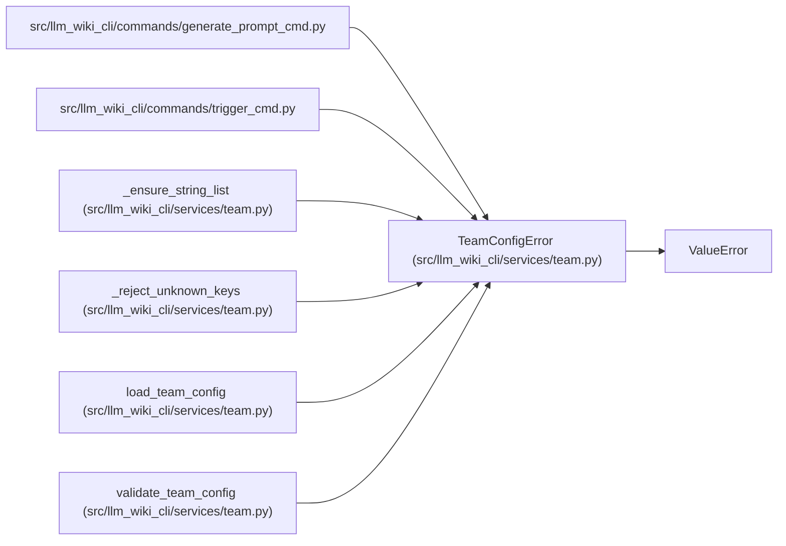

# TeamConfigError

**Location:** `src/llm_wiki_cli/services/team.py:65`
**Kind:** Class
**Bases:** `ValueError`
**Module:** [team](../modules/team.md)

## Description

Raised when `.llm-wiki/team.json` is invalid.

## Attributes

*No annotated attributes found.*

## Methods

*No public methods. Inherits from base classes.*

## Relationships

<!-- Auto-generated relationship summary. Do not edit by hand. -->

### Summary

| Module | Methods | Attributes |
|---|---:|---|
| [team](../modules/team.md) | 0 | — |

### Structure

| Kind | Entity | Module |
|---|---|---|
| Base | `ValueError` | — |

### References

| Reference | Kind | Source | Call sites |
|---|---|---|---:|
| `generate_prompt_cmd` | import | [generate_prompt_cmd](../modules/generate_prompt_cmd.md) | — |
| `trigger_cmd` | import | [trigger_cmd](../modules/trigger_cmd.md) | — |
| `_ensure_string_list` | call | [team](../modules/team.md) | 1 |
| `_reject_unknown_keys` | call | [team](../modules/team.md) | 2 |
| `load_team_config` | call | [team](../modules/team.md) | 2 |
| `validate_team_config` | call | [team](../modules/team.md) | 10 |
