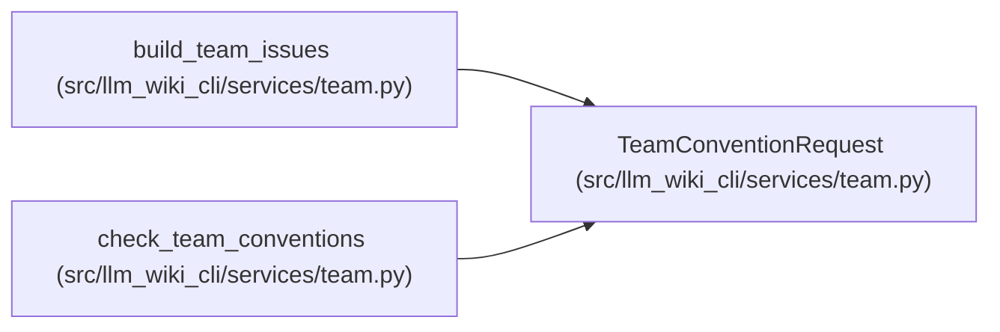

# TeamConventionRequest

**Location:** `src/llm_wiki_cli/services/team.py:70`
**Kind:** Class
**Bases:** —
**Module:** [team](../modules/team.md)

**Decorators:** `@dataclass(frozen=True)`

## Description

Inputs needed to check wiki files against team conventions.

## Attributes

| Name | Type | Default | Description |
|------|------|---------|-------------|
| `config` | `dict[str, Any]` | *required* | — |
| `wiki_dir` | `str \| Path` | *required* | — |
| `src_dir` | `str` | *required* | — |
| `inventory` | `dict[str, Any]` | *required* | — |
| `docker_inventory` | `dict[str, Any] \| None` | `None` | — |

## Methods

| Method | Signature | Decorators | Description |
|--------|-----------|------------|-------------|
| `wiki_path` | `() -> Path` | `@property` | — |

## Relationships

<!-- Auto-generated relationship summary. Do not edit by hand. -->

### Summary

| Module | Methods | Attributes |
|---|---:|---|
| [team](../modules/team.md) | 1 | `config`, `docker_inventory`, `inventory`, `src_dir`, `wiki_dir` |

### References

| Reference | Kind | Source | Call sites |
|---|---|---|---:|
| `build_team_issues` | call | [team](../modules/team.md) | 1 |
| `check_team_conventions` | type_reference | [team](../modules/team.md) | — |
