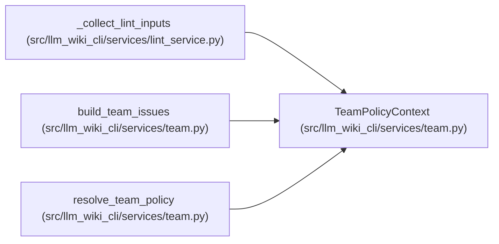

# TeamPolicyContext

**Location:** `src/llm_wiki_cli/services/team.py:76`
**Kind:** Class
**Bases:** —
**Module:** [team](../modules/team.md)

**Decorators:** `@dataclass(frozen=True)`

## Description

One command's resolved policy and project-anchored wiki identity.

## Attributes

| Name | Type | Default | Description |
|------|------|---------|-------------|
| `config` | `dict[str, Any] \| None` | *required* | — |
| `wiki_dir` | `str` | *required* | — |
| `root` | `Path` | *required* | — |

## Methods

*No public methods. Inherits from base classes.*

## Relationships

<!-- Auto-generated relationship summary. Do not edit by hand. -->

### Summary

| Module | Methods | Attributes |
|---|---:|---|
| [team](../modules/team.md) | 0 | `config`, `root`, `wiki_dir` |

### References

| Reference | Kind | Source | Call sites |
|---|---|---|---:|
| `_collect_lint_inputs` | type_reference | [lint_service](../modules/lint_service.md) | — |
| `build_team_issues` | type_reference | [team](../modules/team.md) | — |
| `resolve_team_policy` | call | [team](../modules/team.md) | 1 |
| `resolve_team_policy` | type_reference | [team](../modules/team.md) | — |
