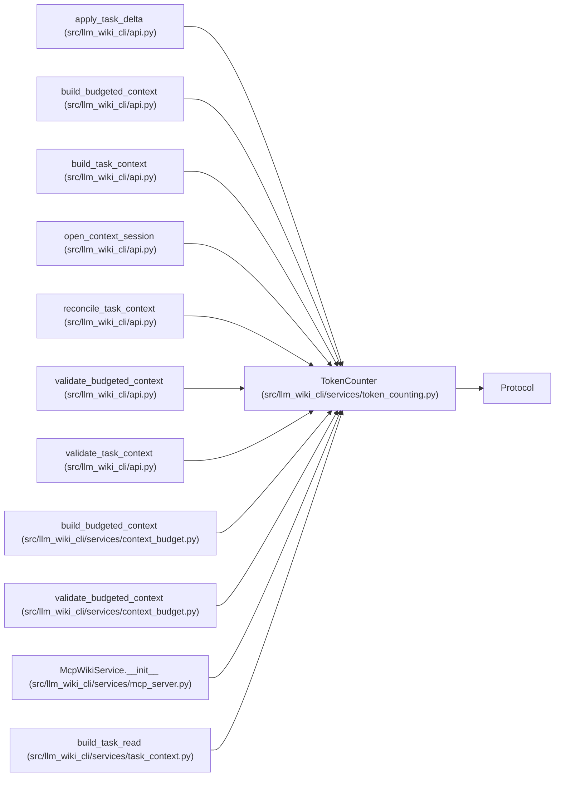

# TokenCounter

**Location:** `src/llm_wiki_cli/services/token_counting.py:10`
**Kind:** Class
**Bases:** `Protocol`
**Module:** [token_counting](../modules/token_counting.md)

## Description

_Auto-generated from `TokenCounter` in `src/llm_wiki_cli/services/token_counting.py`._

## Attributes

| Name | Type | Default | Description |
|------|------|---------|-------------|
| `identity` | `str` | *required* | — |
| `exact` | `bool` | *required* | — |

## Methods

| Method | Signature | Decorators | Description |
|--------|-----------|------------|-------------|
| `count` | `(text: str) -> int` | — | — |

## Relationships

<!-- Auto-generated relationship summary. Do not edit by hand. -->

### Summary

| Module | Methods | Attributes |
|---|---:|---|
| [token_counting](../modules/token_counting.md) | 1 | `exact`, `identity` |

### Structure

| Kind | Entity | Module |
|---|---|---|
| Base | `Protocol` | — |

### References

| Reference | Kind | Source | Call sites |
|---|---|---|---:|
| `apply_task_delta` | type_reference | [api](../modules/api.md) | — |
| `build_budgeted_context` | type_reference | [api](../modules/api.md) | — |
| `build_task_context` | type_reference | [api](../modules/api.md) | — |
| `open_context_session` | type_reference | [api](../modules/api.md) | — |
| `reconcile_task_context` | type_reference | [api](../modules/api.md) | — |
| `validate_budgeted_context` | type_reference | [api](../modules/api.md) | — |
| `validate_task_context` | type_reference | [api](../modules/api.md) | — |
| `build_budgeted_context` | type_reference | [context_budget](../modules/context_budget.md) | — |
| `validate_budgeted_context` | type_reference | [context_budget](../modules/context_budget.md) | — |
| `McpWikiService.__init__` | type_reference | [mcp_server](../modules/mcp_server.md) | — |
| `build_task_read` | type_reference | [task_context](../modules/task_context.md) | — |
