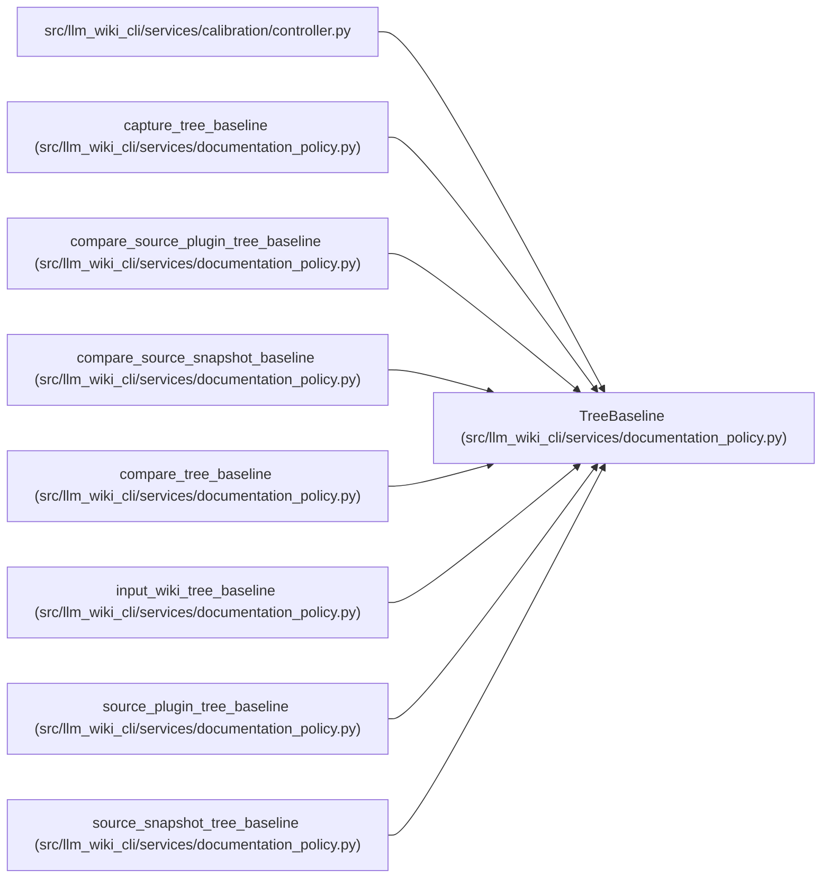

# TreeBaseline

**Location:** `src/llm_wiki_cli/services/documentation_policy.py:76`
**Kind:** Class
**Bases:** —
**Module:** [documentation_policy](../modules/documentation_policy.md)

**Decorators:** `@dataclass(frozen=True)`

## Description

A deterministic, portable content baseline for a read-only tree.

## Attributes

| Name | Type | Default | Description |
|------|------|---------|-------------|
| `root_display` | `str` | *required* | — |
| `tree_hash` | `str` | *required* | — |
| `file_hashes` | `dict[str, str]` | *required* | — |
| `excluded_directories` | `tuple[str, ...]` | `()` | — |

## Methods

| Method | Signature | Decorators | Description |
|--------|-----------|------------|-------------|
| `file_count` | `() -> int` | `@property` | — |
| `to_dict` | `() -> dict[str, Any]` | — | — |
| `from_dict` | `(payload: dict[str, Any]) -> 'TreeBaseline'` | `@classmethod` | — |

## Relationships

<!-- Auto-generated relationship summary. Do not edit by hand. -->

### Summary

| Module | Methods | Attributes |
|---|---:|---|
| [documentation_policy](../modules/documentation_policy.md) | 3 | `excluded_directories`, `file_hashes`, `root_display`, `tree_hash` |

### References

| Reference | Kind | Source |
|---|---|---|
| `controller` | import | [controller](../modules/controller.md) |
| `capture_tree_baseline` | call | [documentation_policy](../modules/documentation_policy.md) |
| `capture_tree_baseline` | type_reference | [documentation_policy](../modules/documentation_policy.md) |
| `compare_source_plugin_tree_baseline` | type_reference | [documentation_policy](../modules/documentation_policy.md) |
| `compare_source_snapshot_baseline` | type_reference | [documentation_policy](../modules/documentation_policy.md) |
| `compare_tree_baseline` | type_reference | [documentation_policy](../modules/documentation_policy.md) |
| `input_wiki_tree_baseline` | type_reference | [documentation_policy](../modules/documentation_policy.md) |
| `source_plugin_tree_baseline` | call | [documentation_policy](../modules/documentation_policy.md) |
| `source_plugin_tree_baseline` | call | [documentation_policy](../modules/documentation_policy.md) |
| `source_plugin_tree_baseline` | type_reference | [documentation_policy](../modules/documentation_policy.md) |
| `source_snapshot_tree_baseline` | call | [documentation_policy](../modules/documentation_policy.md) |
| `source_snapshot_tree_baseline` | type_reference | [documentation_policy](../modules/documentation_policy.md) |
