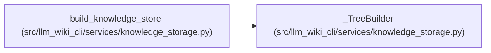

# _TreeBuilder

**Location:** `src/llm_wiki_cli/services/knowledge_storage.py:213`
**Kind:** Class
**Bases:** —
**Module:** [knowledge_storage](../modules/knowledge_storage.md)

## Description

Builds deterministic radix catalogs and record objects from stable owner and record identities. Compressed prefixes and local owner tables limit repeated metadata, while object-size ceilings stop a large record from becoming an unbounded file.

## Attributes

*No annotated attributes found.*

## Methods

| Method | Signature | Decorators | Description |
|--------|-----------|------------|-------------|
| `__init__` | `(target: int)` | — | — |
| `emit` | `(payload: dict[str, Any], count: int) -> dict[str, Any]` | — | — |
| `tree` | `(collection: str, records: list[dict[str, Any]], prefix: str = '') -> dict[str, Any]` | — | — |

## Relationships

<!-- Auto-generated relationship summary. Do not edit by hand. -->

### Summary

| Module | Methods | Attributes |
|---|---:|---|
| [knowledge_storage](../modules/knowledge_storage.md) | 3 | — |

### References

| Reference | Kind | Source | Call sites |
|---|---|---|---:|
| `build_knowledge_store` | call | [knowledge_storage](../modules/knowledge_storage.md) | 1 |