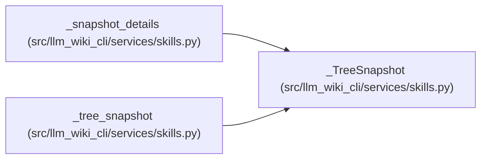

# _TreeSnapshot

**Location:** `src/llm_wiki_cli/services/skills.py:975`
**Kind:** Class
**Bases:** —
**Module:** [skills](../modules/skills.md)

**Decorators:** `@dataclass(frozen=True)`

## Description

_Auto-generated from `_TreeSnapshot` in `src/llm_wiki_cli/services/skills.py`._

## Attributes

| Name | Type | Default | Description |
|------|------|---------|-------------|
| `files` | `frozenset[str]` | *required* | — |
| `directories` | `frozenset[str]` | *required* | — |
| `unsafe` | `tuple[str, ...]` | `()` | — |
| `unreadable` | `tuple[str, ...]` | `()` | — |

## Methods

*No public methods. Inherits from base classes.*

## Relationships

<!-- Auto-generated relationship summary. Do not edit by hand. -->

### Summary

| Module | Methods | Attributes |
|---|---:|---|
| [skills](../modules/skills.md) | 0 | `directories`, `files`, `unreadable`, `unsafe` |

### References

| Reference | Kind | Source | Call sites |
|---|---|---|---:|
| `_snapshot_details` | type_reference | [skills](../modules/skills.md) | — |
| `_tree_snapshot` | call | [skills](../modules/skills.md) | 1 |
| `_tree_snapshot` | type_reference | [skills](../modules/skills.md) | — |
