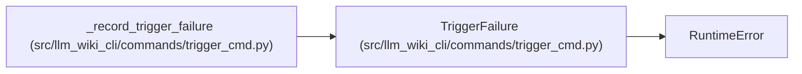

# TriggerFailure

**Location:** `src/llm_wiki_cli/commands/trigger_cmd.py:39`
**Kind:** Class
**Bases:** `RuntimeError`
**Module:** [trigger_cmd](../modules/trigger_cmd.md)

## Description

A recorded failed run, with its portable process exit status.

## Attributes

*No annotated attributes found.*

## Methods

| Method | Signature | Decorators | Description |
|--------|-----------|------------|-------------|
| `__init__` | `(exit_code: int)` | — | — |

## Relationships

<!-- Auto-generated relationship summary. Do not edit by hand. -->

### Summary

| Module | Methods | Attributes |
|---|---:|---|
| [trigger_cmd](../modules/trigger_cmd.md) | 1 | — |

### Structure

| Kind | Entity | Module |
|---|---|---|
| Base | `RuntimeError` | — |

### References

| Reference | Kind | Source | Call sites |
|---|---|---|---:|
| `_record_trigger_failure` | call | [trigger_cmd](../modules/trigger_cmd.md) | 1 |
