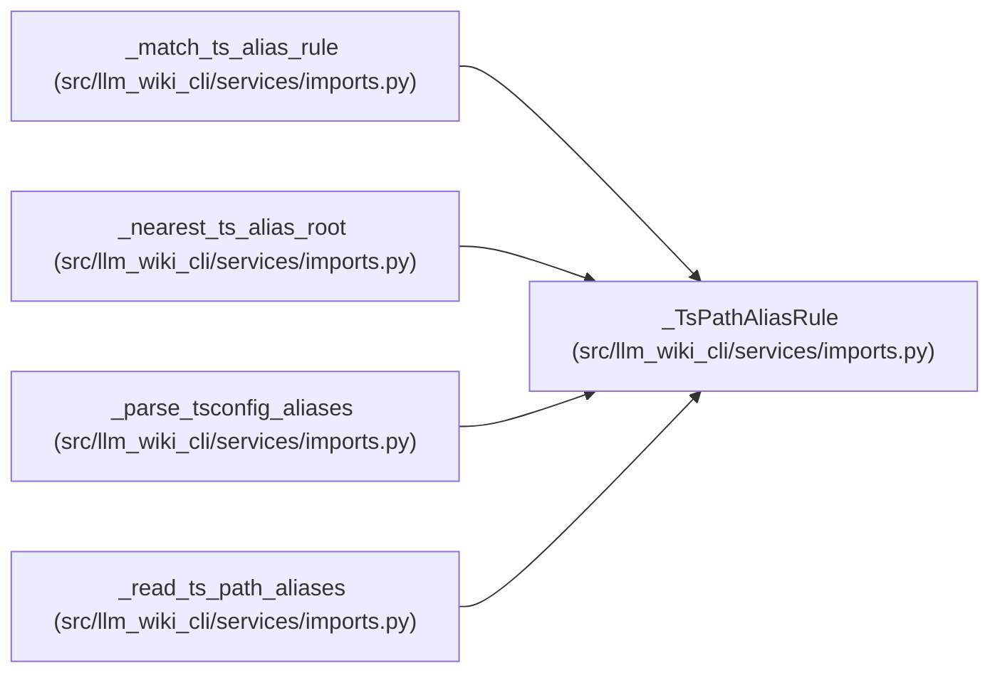

# _TsPathAliasRule

**Location:** `src/llm_wiki_cli/services/imports.py:22`
**Kind:** Class
**Bases:** —
**Module:** [imports](../modules/imports.md)

**Decorators:** `@dataclass(frozen=True)`

## Description

One ``compilerOptions.paths`` mapping scoped to its tsconfig directory.

## Attributes

| Name | Type | Default | Description |
|------|------|---------|-------------|
| `root` | `str` | *required* | — |
| `prefix` | `str` | *required* | — |
| `suffix` | `str` | *required* | — |
| `wildcard` | `bool` | *required* | — |
| `targets` | `tuple[str, ...]` | *required* | — |

## Methods

*No public methods. Inherits from base classes.*

## Relationships

<!-- Auto-generated relationship summary. Do not edit by hand. -->

### Summary

| Module | Methods | Attributes |
|---|---:|---|
| [imports](../modules/imports.md) | 0 | `prefix`, `root`, `suffix`, `targets`, `wildcard` |

### References

| Reference | Kind | Source |
|---|---|---|
| `_match_ts_alias_rule` | type_reference | [imports](../modules/imports.md) |
| `_nearest_ts_alias_root` | type_reference | [imports](../modules/imports.md) |
| `_parse_tsconfig_aliases` | call | [imports](../modules/imports.md) |
| `_parse_tsconfig_aliases` | type_reference | [imports](../modules/imports.md) |
| `_read_ts_path_aliases` | type_reference | [imports](../modules/imports.md) |
