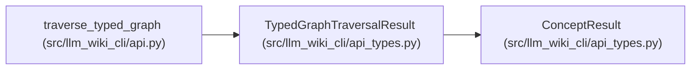

# TypedGraphTraversalResult

**Location:** `src/llm_wiki_cli/api_types.py:231`
**Kind:** Class
**Bases:** `ConceptResult`
**Module:** [api_types](../modules/api_types.md)

## Description

_Auto-generated from `TypedGraphTraversalResult` in `src/llm_wiki_cli/api_types.py`._

## Attributes

| Name | Type | Default | Description |
|------|------|---------|-------------|
| `direction` | `str` | *required* | — |
| `kinds` | `list[str]` | *required* | — |
| `origins` | `list[str]` | *required* | — |
| `resolutions` | `list[str]` | *required* | — |
| `include_evidence` | `bool` | *required* | — |
| `typed_graph` | `dict[str, Any]` | *required* | — |
| `edges` | `list[dict[str, Any]]` | *required* | — |

## Methods

*No public methods. Inherits from base classes.*

## Relationships

<!-- Auto-generated relationship summary. Do not edit by hand. -->

### Summary

| Module | Methods | Attributes |
|---|---:|---|
| [api_types](../modules/api_types.md) | 0 | `direction`, `edges`, `include_evidence`, `kinds`, `origins`, `resolutions`, `typed_graph` |

### Structure

| Kind | Entity | Module |
|---|---|---|
| Base | `ConceptResult` | [api_types](../modules/api_types.md) |

### References

| Reference | Kind | Source |
|---|---|---|
| `traverse_typed_graph` | type_reference | [api](../modules/api.md) |
