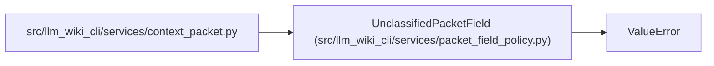

# UnclassifiedPacketField

**Location:** `src/llm_wiki_cli/services/packet_field_policy.py:24`
**Kind:** Class
**Bases:** `ValueError`
**Module:** [packet_field_policy](../modules/packet_field_policy.md)

## Description

_Auto-generated from `UnclassifiedPacketField` in `src/llm_wiki_cli/services/packet_field_policy.py`._

## Attributes

*No annotated attributes found.*

## Methods

| Method | Signature | Decorators | Description |
|--------|-----------|------------|-------------|
| `__init__` | `(pointer: tuple[str, ...])` | — | — |

## Relationships

<!-- Auto-generated relationship summary. Do not edit by hand. -->

### Summary

| Module | Methods | Attributes |
|---|---:|---|
| [packet_field_policy](../modules/packet_field_policy.md) | 1 | — |

### Structure

| Kind | Entity | Module |
|---|---|---|
| Base | `ValueError` | — |

### References

| Reference | Kind | Source | Call sites |
|---|---|---|---:|
| `context_packet` | import | [context_packet](../modules/context_packet.md) | — |
