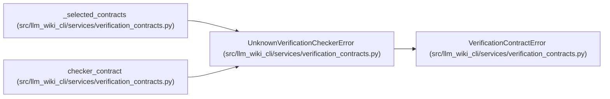

# UnknownVerificationCheckerError

**Location:** `src/llm_wiki_cli/services/verification_contracts.py:79`
**Kind:** Class
**Bases:** `VerificationContractError`
**Module:** [verification_contracts](../modules/verification_contracts.md)

## Description

Raised before execution when a requested checker is not registered.

## Attributes

*No annotated attributes found.*

## Methods

| Method | Signature | Decorators | Description |
|--------|-----------|------------|-------------|
| `__init__` | `(checker_id: object)` | — | — |

## Relationships

<!-- Auto-generated relationship summary. Do not edit by hand. -->

### Summary

| Module | Methods | Attributes |
|---|---:|---|
| [verification_contracts](../modules/verification_contracts.md) | 1 | — |

### Structure

| Kind | Entity | Module |
|---|---|---|
| Base | `VerificationContractError` | [verification_contracts](../modules/verification_contracts.md) |

### References

| Reference | Kind | Source |
|---|---|---|
| `_selected_contracts` | call | [verification_contracts](../modules/verification_contracts.md) |
| `_selected_contracts` | call | [verification_contracts](../modules/verification_contracts.md) |
| `_selected_contracts` | call | [verification_contracts](../modules/verification_contracts.md) |
| `checker_contract` | call | [verification_contracts](../modules/verification_contracts.md) |
