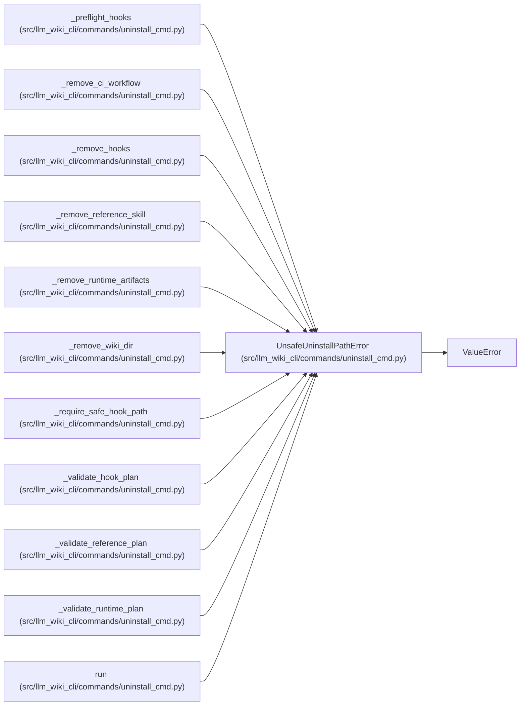

# UnsafeUninstallPathError

**Location:** `src/llm_wiki_cli/commands/uninstall_cmd.py:58`
**Kind:** Class
**Bases:** `ValueError`
**Module:** [uninstall_cmd](../modules/uninstall_cmd.md)

## Description

Raised when an uninstall-owned path could escape the project tree.

## Attributes

*No annotated attributes found.*

## Methods

*No public methods. Inherits from base classes.*

## Relationships

<!-- Auto-generated relationship summary. Do not edit by hand. -->

### Summary

| Module | Methods | Attributes |
|---|---:|---|
| [uninstall_cmd](../modules/uninstall_cmd.md) | 0 | — |

### Structure

| Kind | Entity | Module |
|---|---|---|
| Base | `ValueError` | — |

### References

| Reference | Kind | Source | Call sites |
|---|---|---|---:|
| `_preflight_hooks` | call | [uninstall_cmd](../modules/uninstall_cmd.md) | 3 |
| `_remove_ci_workflow` | call | [uninstall_cmd](../modules/uninstall_cmd.md) | 1 |
| `_remove_hooks` | call | [uninstall_cmd](../modules/uninstall_cmd.md) | 1 |
| `_remove_reference_skill` | call | [uninstall_cmd](../modules/uninstall_cmd.md) | 2 |
| `_remove_runtime_artifacts` | call | [uninstall_cmd](../modules/uninstall_cmd.md) | 2 |
| `_remove_wiki_dir` | call | [uninstall_cmd](../modules/uninstall_cmd.md) | 3 |
| `_require_safe_hook_path` | call | [uninstall_cmd](../modules/uninstall_cmd.md) | 1 |
| `_validate_hook_plan` | call | [uninstall_cmd](../modules/uninstall_cmd.md) | 1 |
| `_validate_reference_plan` | call | [uninstall_cmd](../modules/uninstall_cmd.md) | 1 |
| `_validate_runtime_plan` | call | [uninstall_cmd](../modules/uninstall_cmd.md) | 1 |
| `run` | call | [uninstall_cmd](../modules/uninstall_cmd.md) | 2 |
